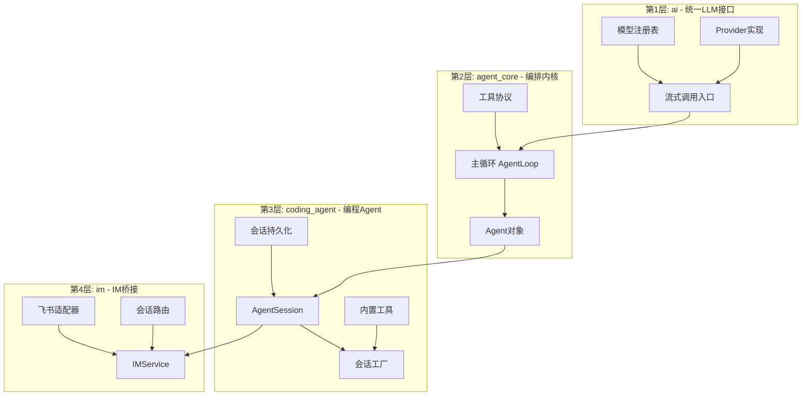

# LiaoClaw

> 统一 LLM 调用 + Agent 编排内核 + 飞书 IM 桥接 —— 用 Python 从零搭建一个完整的 AI 编程助手系统。

## 这个项目到底是干啥的？

想象一下你经常点外卖。你手机上装了美团、饿了么、还有各种小程序，每个平台的操作方式都不一样，下单流程也不同。如果有人帮你搞了一个"万能外卖中台"——不管你想点哪家的饭，统一一个入口下单、统一看配送进度、统一收到通知——那该多爽？

**LiaoClaw 就是 AI 世界的"万能外卖中台"。**

- **不同的 AI 厂商**（Anthropic Claude、OpenAI GPT、智谱 GLM 等）就像不同的餐厅
- **统一 LLM 接口层**就是那个中台，帮你屏蔽各家 API 的差异
- **Agent 编排内核**就是"外卖骑手调度系统"——接到你的需求后，它会自动规划路线（调用工具、读写文件、执行命令），一步一步帮你完成任务
- **飞书 IM 桥接**就是"外卖 App 的聊天客服"——你在飞书群里 @它说一句话，它就像客服一样实时回复你，还能记住之前聊过什么

简单来说：**你用自然语言告诉它你想干什么，它帮你读代码、写代码、跑命令，然后把结果告诉你。**

## 学完这个项目，你能收获什么？

如果你是一个刚学完 Python 基础语法的小白，通过阅读和理解这个项目，你能获得以下实战能力：

| 能力 | 具体内容 |
|------|---------|
| Python 异步编程 | `async/await`、`asyncio` 事件循环、并发任务管理 |
| 流式数据处理 | SSE（Server-Sent Events）协议解析、异步迭代器 |
| HTTP 客户端开发 | 使用 `httpx` 发起流式请求、处理各种 API 认证 |
| 设计模式实战 | 注册表模式、工厂模式、观察者/发布订阅模式、适配器模式 |
| Agent 系统架构 | 理解"模型调用 → 工具执行 → 再次推理"的经典 Agent Loop |
| 会话与持久化 | JSONL 格式存储、会话树结构（支持分叉/切换）|
| 插件/扩展系统 | 动态加载扩展、Skill 系统、MCP 工具代理 |
| IM 机器人开发 | 飞书 Webhook/长连接、消息去重、频道级会话管理 |

## 技术栈拆解

| 技术 | 为什么用它？ |
|------|------------|
| **Python 3.10+** | 项目主语言，用到了 `match`、`Union` 类型标注、`dataclass` 等现代特性 |
| **asyncio** | Python 内置的异步框架，让程序能同时处理多个 LLM 请求而不阻塞 |
| **httpx** | 比 `requests` 更现代的 HTTP 客户端，原生支持异步和流式响应 |
| **dataclass** | Python 的数据类装饰器，用来定义清晰的消息、模型、事件等数据结构 |
| **setuptools** | Python 标准打包工具，让项目可以通过 `pip install -e .` 安装为可执行命令 |
| **lark-oapi**（可选） | 飞书官方 SDK，用于对接飞书 IM 消息收发 |
| **pytest**（开发依赖） | Python 最流行的测试框架，项目里有完整的单元测试覆盖 |

## 快速开始

### 1. 环境准备

```bash
# 确保 Python 版本 >= 3.10
python --version

# 克隆项目后进入目录
cd LiaoClaw
```

### 2. 配置环境变量

```bash
# 复制环境变量模板
cp .env.example .env          # Linux/macOS
copy .env.ps1.example .env.ps1  # Windows PowerShell
```

打开复制的文件，填入你的 API Key：

```bash
# 至少需要一个 LLM 的 API Key
ANTHROPIC_API_KEY=sk-ant-你的密钥
# 或者
OPENAI_API_KEY=sk-你的密钥
```

### 3. 安装并运行

```bash
# 以开发模式安装（推荐）
pip install -e ".[dev]"

# 方式一：CLI 交互模式（最简单的上手方式）
python -m coding_agent --mode interactive --provider anthropic --model-id glm-4.5-air

# 方式二：运行最小示例脚本
python examples/quickstart.py

# 方式三：启动前端 Web 控制台
liaoclaw-web --provider anthropic --model-id glm-4.5-air --host 127.0.0.1 --port 8787
```

**Windows 用户**可以直接用开发脚本：

```powershell
# CLI 模式
.\dev.ps1 -Mode cli

# IM 模式（需要先配置飞书凭据）
.\dev.ps1 -Mode im -Transport longconn
```

### 4. 运行测试

```bash
pytest tests/ -v
```

## 项目结构一览

```
LiaoClaw/
├── pyproject.toml              # 项目元数据、依赖、CLI 入口配置
├── .env.example                # 环境变量模板
├── dev.ps1 / dev.sh            # 本地开发启动脚本
│
├── src/                        # 所有源码
│   ├── ai/                     # 第1层：统一 LLM 接口
│   │   ├── types.py            #   消息、模型、工具等核心数据结构
│   │   ├── models.py           #   内置模型注册表
│   │   ├── stream.py           #   统一的流式/非流式调用入口
│   │   ├── event_stream.py     #   异步事件流封装
│   │   ├── api_registry.py     #   Provider 注册与查找
│   │   ├── overflow.py         #   Token 溢出粗算
│   │   ├── env_api_keys.py     #   从环境变量读取 API Key
│   │   └── providers/          #   各厂商的具体实现
│   │       ├── anthropic.py    #     Anthropic Claude API
│   │       └── openai_compatible.py  # OpenAI 兼容 API
│   │
│   ├── agent_core/             # 第2层：Agent 编排内核
│   │   ├── agent.py            #   Agent 类：对外入口
│   │   ├── agent_loop.py       #   核心主循环逻辑
│   │   └── types.py            #   工具协议、事件类型、配置
│   │
│   ├── coding_agent/           # 第3层：编程 Agent 应用
│   │   ├── factory.py          #   会话工厂（组装一切）
│   │   ├── agent_session.py    #   会话管理（溢出压缩、重试）
│   │   ├── builtin_tools.py    #   内置工具（读/写/编辑/bash/grep）
│   │   ├── session_store.py    #   会话持久化（JSONL）
│   │   ├── system_prompt.py    #   系统提示词构建
│   │   ├── cli.py              #   命令行参数解析
│   │   ├── runner.py           #   运行模式（print/interactive/rpc）
│   │   ├── extensions/         #   扩展与 Skill 加载
│   │   └── mcp/                #   MCP 工具代理
│   │
│   └── im/                     # 第4层：IM 飞书桥接
│       ├── service.py          #   IMService 核心服务
│       ├── feishu.py           #   飞书适配器
│       ├── feishu_longconn.py  #   飞书长连接
│       ├── server.py           #   Webhook HTTP 服务
│       ├── session_router.py   #   频道→会话路由映射
│       └── memory.py           #   长期记忆（MEMORY.md）
│
├── examples/                   # 示例脚本（从简到繁）
│   ├── quickstart.py           #   最小 LLM 调用
│   ├── agent_core_quickstart.py #  Agent + 工具
│   └── coding_agent_*.py       #  编程 Agent 各种用法
│
└── tests/                      # 单元测试
    ├── test_agent_core_loop.py
    ├── test_coding_agent_*.py
    └── test_im_*.py
```

## 架构总览



## 学习路线建议

如果你是零基础小白，建议按以下顺序阅读 `docs/` 下的学习笔记：

1. **先看总览** → `docs/00_文件总览.md`
2. **从底层开始** → `docs/01_AI统一接口层/` —— 理解数据怎么流动
3. **理解核心** → `docs/02_Agent编排内核/` —— 理解 Agent 怎么"思考"
4. **看应用层** → `docs/03_编程Agent应用层/` —— 理解完整产品怎么搭建
5. **最后看集成** → `docs/04_IM飞书桥接层/` —— 理解怎么对接外部平台
