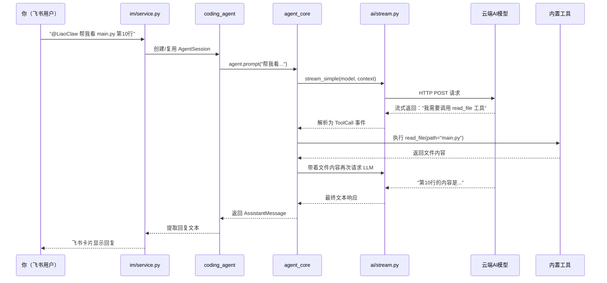
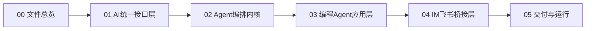

# LiaoClaw 小白学习总览

## 写在最前面

欢迎来到 LiaoClaw 学习之旅！

如果你刚学完 Python 基础语法（变量、函数、类、列表字典、文件读写），但从来没看过一个"真正的项目"，那这份指南就是为你准备的。

我们不会假设你懂什么设计模式、异步编程、HTTP 协议。每一个新概念都会用"大白话 + 生活比喻"来解释，然后再带你看代码。

## 这个项目是什么？一句话说清楚

**LiaoClaw 是一个用 Python 写的 AI 编程助手系统。** 你在命令行或飞书里跟它说话，它能帮你读代码、写代码、执行命令、搜索文件——就像有一个 24 小时在线的程序员搭档。

## 整体架构：像盖楼一样，一层一层往上搭

整个系统分成 4 层，就像盖一栋楼：

```
┌──────────────────────────────────┐
│  第4层：IM 飞书桥接 (im/)         │  ← 用户通过飞书跟 Agent 对话
├──────────────────────────────────┤
│  第3层：编程 Agent 应用 (coding_agent/) │  ← 工具、会话、CLI
├──────────────────────────────────┤
│  第2层：Agent 编排内核 (agent_core/)    │  ← "大脑"，决定调什么工具
├──────────────────────────────────┤
│  第1层：统一 LLM 接口 (ai/)            │  ← 跟各家 AI 厂商通信
└──────────────────────────────────┘
```

**类比：** 就像你去一家火锅店吃饭——

- **第1层（ai）** = 后厨的供应链，负责从不同供应商（Anthropic、OpenAI）进货（调用 API），不管哪家供应商，端到前台的食材格式都一样
- **第2层（agent_core）** = 大厨，拿到食材后决定先涮什么、后煮什么，一道菜一道菜地安排（Agent 循环）
- **第3层（coding_agent）** = 整个餐厅的运营系统，管着菜单（工具列表）、订单记录（会话存储）、前台点餐机（CLI）
- **第4层（im）** = 外卖接单渠道，把飞书上的消息转成"堂食订单"交给餐厅处理

## 一次完整请求的生命周期

当你在飞书里发一条消息"帮我看一下 main.py 的第 10 行是什么"，系统内部会发生什么？



## 学习路线图

建议你按顺序学习，每个模块都建立在前一个的基础之上：



### 第1站：AI 统一接口层（`src/ai/`）

这是整个系统的"地基"。你会学到：

| 文档 | 学什么 |
|------|--------|
| `01_消息与模型类型体系.md` | 理解系统中"消息"是什么样子的数据结构，就像学快递行业先要认识快递单 |
| `02_Provider注册与分发机制.md` | 理解系统怎么管理多家 AI 厂商，就像外卖平台怎么管理多家餐厅 |
| `03_流式响应与事件流.md` | 理解 AI 的回复为什么是"一个字一个字蹦出来的"，以及怎么处理这种流式数据 |
| `04_Token溢出估算.md` | 理解为什么对话太长会被截断，以及怎么估算"还能说多少话" |

### 第2站：Agent 编排内核（`src/agent_core/`）

这是系统的"大脑"。你会学到：

| 文档 | 学什么 |
|------|--------|
| `01_Agent对象与生命周期.md` | Agent 从创建到运行到结束的完整过程 |
| `02_主循环详解.md` | Agent 怎么"思考→行动→再思考"的核心循环 |
| `03_工具协议与执行策略.md` | 怎么定义一个"工具"让 AI 调用，串行和并行有什么区别 |
| `04_事件驱动架构.md` | 系统内部怎么用"事件"传递消息，就像广播电台一样 |

### 第3站：编程 Agent 应用层（`src/coding_agent/`）

这是把"大脑"包装成真正可用产品的地方。你会学到：

| 文档 | 学什么 |
|------|--------|
| `01_会话工厂与资源加载.md` | 系统启动时怎么把所有零件组装起来 |
| `02_内置工具实现.md` | read/write/edit/bash/grep 这些工具是怎么实现的 |
| `03_会话持久化与分叉.md` | 聊天记录怎么保存到磁盘，怎么支持"存档+读档" |
| `04_上下文压缩与重试.md` | 对话太长怎么压缩，请求失败怎么自动重试 |
| `05_CLI与运行模式.md` | 命令行界面怎么设计，三种运行模式有什么区别 |

### 第4站：IM 飞书桥接层（`src/im/`）

这是让 Agent 走出命令行、进入真实聊天场景的地方。你会学到：

| 文档 | 学什么 |
|------|--------|
| `01_IM服务核心架构.md` | IMService 怎么把飞书消息转成 Agent 的输入 |
| `02_飞书适配器实现.md` | 飞书 API 怎么收发消息，Webhook 和长连接有什么区别 |
| `03_会话路由与记忆系统.md` | 怎么让每个飞书频道有自己的对话上下文和长期记忆 |

### 第5站：交付与运行（`docs/05_交付与运行/`）

这是把项目“发给别人也能直接跑”的落地文档。你会学到：

| 文档 | 学什么 |
|------|--------|
| `01_项目交付运行手册.md` | 一套可复制执行的安装、配置、启动、排障与交付验收流程 |

## 核心入口文件速查

| 你想做什么 | 看哪个文件 |
|-----------|-----------|
| 了解所有数据结构长什么样 | `src/ai/types.py` |
| 看最简单的 LLM 调用示例 | `examples/quickstart.py` |
| 看 Agent + 工具的示例 | `examples/agent_core_quickstart.py` |
| 理解 Agent 的核心循环 | `src/agent_core/agent_loop.py` |
| 看有哪些内置工具 | `src/coding_agent/builtin_tools.py` |
| 理解系统怎么组装的 | `src/coding_agent/factory.py` |
| 看飞书桥接怎么工作 | `src/im/service.py` |

## 阅读代码的小建议

1. **先跑示例**：在看源码之前，先 `python examples/quickstart.py` 跑一遍，有个感性认识
2. **从数据结构开始**：先看 `ai/types.py`，理解"消息长什么样"比理解"消息怎么处理"更重要
3. **跟着调用链走**：每篇笔记都会给出 Mermaid 时序图，跟着箭头的方向读代码
4. **不怕看不懂**：遇到 `async/await` 先跳过，知道"这个函数需要等结果"就行，后面会专门解释
5. **善用测试文件**：`tests/` 目录下的测试就是最好的"使用说明书"，看看别人怎么调用这些函数的
