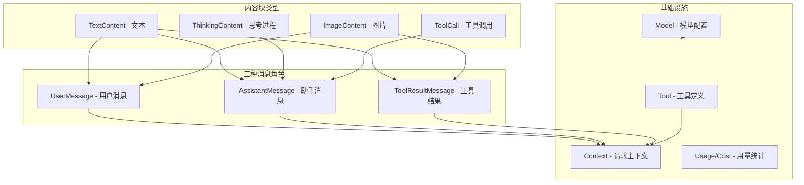

# 01 消息与模型类型体系

> 对应源码：`src/ai/types.py`

## 先不看代码——用"快递单"来理解

想象你在网上买东西，每个包裹都有一张快递单，上面写着：寄件人是谁、收件人是谁、包裹里装了什么、走的哪家快递公司。

在 AI 系统中也一样。每次你跟 AI 对话，都会产生一系列"消息"，每条消息就像一张快递单：

- **谁说的**（角色 role）：是你（user）说的？还是 AI（assistant）回复的？还是工具（toolResult）返回的？
- **说了什么**（内容 content）：文本？图片？还是工具调用指令？
- **走的哪条线路**（模型 model）：用的 Anthropic Claude？还是 OpenAI GPT？

`types.py` 就是定义这些"快递单格式"的文件。**它是整个项目最基础的文件**——后面所有模块都在用这些数据结构。

## 概念地图



## 源码精读

### 1. 内容块：消息里装的"货物"

一条消息的内容不是一个简单的字符串，而是一个"块"的列表。就像一个包裹里可以同时装书和文具。

```python
@dataclass
class TextContent:
    """普通文本块——最常见的内容类型。"""
    type: Literal["text"] = "text"      # 固定标识，方便判断类型
    text: str = ""                       # 实际文本内容
    text_signature: Optional[str] = None # 可选的签名（高级特性，先忽略）


@dataclass
class ThinkingContent:
    """模型的思考过程——有些 AI 会先"想一想"再回答。"""
    type: Literal["thinking"] = "thinking"
    thinking: str = ""                        # 思考的文本内容
    thinking_signature: Optional[str] = None
    redacted: bool = False                    # 是否被隐藏


@dataclass
class ImageContent:
    """图片块——用 base64 编码承载图片数据。"""
    type: Literal["image"] = "image"
    data: str = ""              # base64 编码的图片数据
    mime_type: str = "image/png" # 图片格式


@dataclass
class ToolCall:
    """工具调用——AI 说"我需要用某个工具"时产生的指令。"""
    type: Literal["toolCall"] = "toolCall"
    id: str = ""                              # 每次调用的唯一标识
    name: str = ""                            # 要调用哪个工具
    arguments: dict[str, Any] = field(default_factory=dict)  # 工具参数
```

**小白理解要点**：
- `@dataclass` 是 Python 的一个装饰器，自动帮你生成 `__init__`、`__repr__` 等方法。你只需要列出字段就行。
- `Literal["text"]` 表示这个字段的值只能是 `"text"` 这个字符串，不能是别的。这是用来做"类型标签"的。
- `field(default_factory=dict)` 意思是"默认值是一个新的空字典"。不能直接写 `arguments: dict = {}`，因为那样所有实例会共享同一个字典（Python 经典坑！）。

### 2. 三种消息角色

```python
@dataclass
class UserMessage:
    """用户发的消息。"""
    role: Literal["user"] = "user"
    content: Union[str, list[UserBlock]] = ""  # 可以是纯文本，也可以是多个内容块
    timestamp: int = 0                          # 发送时间（毫秒时间戳）


@dataclass
class AssistantMessage:
    """AI 助手的回复——信息最丰富的消息类型。"""
    role: Literal["assistant"] = "assistant"
    content: list[AssistantBlock] = field(default_factory=list)  # 回复内容（文本+思考+工具调用）
    api: Api = ""              # 用的哪种 API 协议
    provider: Provider = ""    # 用的哪家供应商
    model: str = ""            # 具体模型 ID
    usage: Usage = field(default_factory=Usage)  # token 使用统计
    stop_reason: StopReason = "stop"             # 为什么停下来的
    response_id: Optional[str] = None
    error_message: Optional[str] = None          # 如果出错了，错误信息是什么
    timestamp: int = 0


@dataclass
class ToolResultMessage:
    """工具执行完后返回的结果。"""
    role: Literal["toolResult"] = "toolResult"
    tool_call_id: str = ""      # 对应哪个 ToolCall（通过 id 关联）
    tool_name: str = ""         # 工具名称
    content: list[ToolResultBlock] = field(default_factory=list)  # 执行结果
    is_error: bool = False      # 是否执行出错
    details: Any = None         # 额外细节
    timestamp: int = 0


# 统一的消息类型——任何一条消息都是这三者之一
Message = Union[UserMessage, AssistantMessage, ToolResultMessage]
```

**小白理解要点**：
- `Union[str, list[UserBlock]]` 表示"这个字段要么是字符串，要么是列表"。Python 3.10+ 也可以写成 `str | list[UserBlock]`。
- `StopReason` 只有 5 种可能的值：`"stop"`（正常结束）、`"length"`（太长被截断）、`"toolUse"`（需要调用工具）、`"error"`（出错）、`"aborted"`（被中断）。
- `ToolResultMessage` 通过 `tool_call_id` 跟 `ToolCall` 配对——AI 说"我要调用工具 A"（ToolCall），工具执行完后返回"工具 A 的结果是 xxx"（ToolResultMessage），两者通过 id 关联。

### 3. 工具定义和请求上下文

```python
@dataclass
class Tool:
    """可被模型调用的工具定义——告诉 AI "你有哪些工具可以用"。"""
    name: str                    # 工具名，如 "read_file"
    description: str             # 工具说明，AI 根据这个决定什么时候用
    parameters: dict[str, Any]   # JSON Schema 格式的参数定义


@dataclass
class Context:
    """一次请求的完整上下文——把所有信息打包送给 LLM。"""
    messages: list[Message]              # 对话历史
    system_prompt: Optional[str] = None  # 系统提示词（"你是一个编程助手..."）
    tools: Optional[list[Tool]] = None   # 可用工具列表
```

`Context` 是整个系统中最重要的"容器"之一。**每次调用 LLM 时，都是把一个 Context 发过去。** 就像你去医院看病，要把病历本（历史消息）、主诉（当前问题）、可用的检查项目（工具）一起交给医生。

### 4. 模型配置

```python
@dataclass
class Model:
    """模型配置——描述一个 AI 模型的所有信息。"""
    id: str              # 模型 ID，如 "claude-sonnet-4-5"
    name: str            # 模型显示名称
    api: Api             # 请求走哪种协议（"anthropic-messages" 或 "openai-standard"）
    provider: Provider   # 供应商名（用于找 API Key）
    base_url: str        # API 地址
    reasoning: bool      # 是否支持"思考"模式
    input: list[...]     # 支持的输入类型（文本、图片）
    context_window: int  # 上下文窗口大小（能记住多少 token）
    max_tokens: int      # 单次回复最大 token 数
    cost: Cost = ...     # 费率
    headers: Optional[dict[str, str]] = None  # 额外请求头
    compat: Optional[dict[str, Any]] = None   # 兼容性配置
```

**关键概念——`api` 与 `provider` 的区别**：
- `api` 决定走哪种**协议**（Anthropic Messages 格式还是 OpenAI Chat 格式）
- `provider` 决定用谁的 **API Key**

这两个可以不同！比如智谱 GLM 的 `api` 是 `"anthropic-messages"`（因为它兼容 Anthropic 的协议），但 `provider` 是 `"anthropic"`（用 Anthropic 的 Key 格式）。

## 小白避坑指南

### 坑 1：`field(default_factory=...)` 是什么？为什么不能直接写 `= []`？

```python
# 错误写法——所有实例共享同一个列表！
@dataclass
class Bad:
    items: list = []

a = Bad()
b = Bad()
a.items.append("hello")
print(b.items)  # 输出 ["hello"]！b 也被改了！

# 正确写法——每个实例都有自己的列表
@dataclass
class Good:
    items: list = field(default_factory=list)
```

这是 Python 的经典陷阱：可变默认值（列表、字典）会被所有实例共享。`field(default_factory=list)` 确保每次创建实例时都生成一个全新的空列表。

### 坑 2：`Union` 类型怎么判断具体是哪种？

```python
msg: Message = ...  # 不知道是 UserMessage 还是 AssistantMessage

# 用 isinstance 判断
if isinstance(msg, UserMessage):
    print("这是用户消息")
elif isinstance(msg, AssistantMessage):
    print("这是助手消息")
elif isinstance(msg, ToolResultMessage):
    print("这是工具结果")
```

整个项目中大量使用这种模式。看到 `isinstance(msg, AssistantMessage)` 就知道是在判断消息角色。

### 坑 3：`Literal` 到底有什么用？

`Literal["text"]` 看起来多此一举——一个字段只能是一个固定值，那还有什么用？

答案是：**用于序列化和反序列化时做类型标识。** 当你把消息保存成 JSON 再读回来时，通过 `type` 字段就能知道这个内容块是文本还是工具调用。在项目的 `serde.py` 文件中你会看到这种用法。
