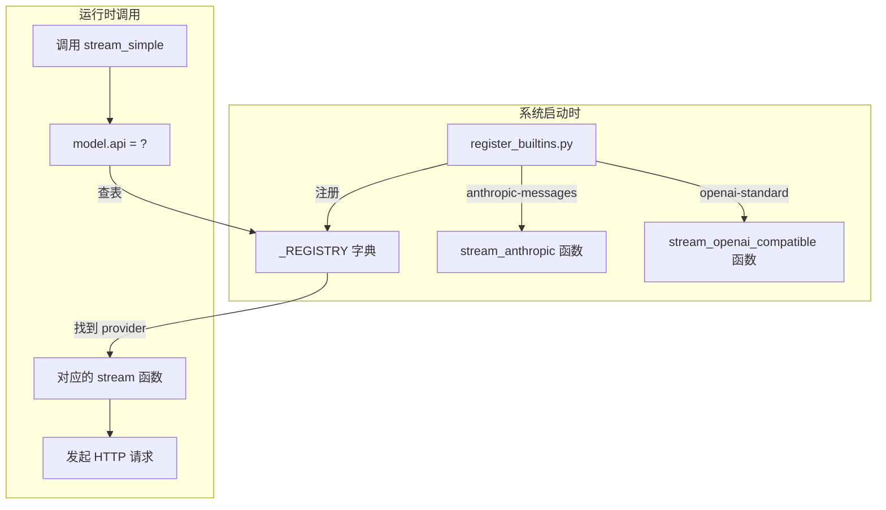
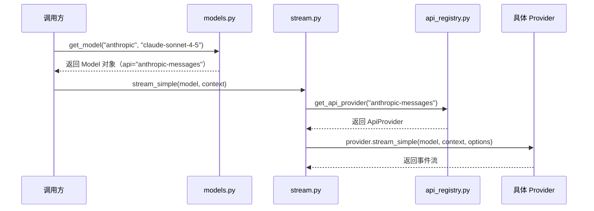

# 02 Provider 注册与分发机制

> 对应源码：`src/ai/api_registry.py`、`src/ai/models.py`、`src/ai/env_api_keys.py`、`src/ai/providers/register_builtins.py`

## 先不看代码——用"外卖平台"来理解

假设你开了一个外卖平台，平台上接入了三家餐厅：兰州拉面、黄焖鸡、沙县小吃。

- 每家餐厅的**菜单不同**（模型列表）
- 每家餐厅的**下单方式不同**（API 协议）——有的用微信接单，有的用打电话
- 你需要一个**登记簿**（注册表），记录每家餐厅用什么方式接单
- 用户下单时，平台根据用户选的餐厅，**自动找到正确的接单方式**（分发）

在 LiaoClaw 中：
- "餐厅" = AI 厂商（Anthropic、OpenAI、智谱等）
- "下单方式" = API 协议（Anthropic Messages、OpenAI Chat Completions）
- "登记簿" = `api_registry.py` 中的 `_REGISTRY` 字典
- "自动分发" = `stream.py` 中根据 `model.api` 查表调用

## 整体流程图



## 源码精读

### 1. 注册表：最简单但最重要的模式（`api_registry.py`）

```python
# 注册表的核心数据结构——就是一个字典
_REGISTRY: dict[str, ApiProvider] = {}


@dataclass
class ApiProvider:
    """每个 provider 需要提供三样东西。"""
    api: str                    # 协议标识，如 "anthropic-messages"
    stream: StreamFn            # 原始流式调用函数
    stream_simple: SimpleStreamFn  # 简化版流式调用函数


def register_api_provider(provider: ApiProvider) -> None:
    """往字典里塞一条记录——就这么简单。"""
    _REGISTRY[provider.api] = provider


def get_api_provider(api: str) -> ApiProvider | None:
    """从字典里取一条记录。"""
    return _REGISTRY.get(api)
```

**为什么要用注册表模式？** 因为以后你想支持新的 AI 厂商时，不需要修改任何已有代码。只需要：

1. 写一个新的 `stream_xxx` 函数
2. 调用 `register_api_provider(...)` 注册进去

调用方的代码（`stream.py`）完全不用改。这就是"开闭原则"——**对扩展开放，对修改关闭。**

### 2. 内置 Provider 的注册（`register_builtins.py`）

```python
def register_builtin_api_providers() -> None:
    """注册两个内置协议。"""
    # Anthropic Messages 协议
    register_api_provider(
        ApiProvider(
            api="anthropic-messages",        # 协议名
            stream=stream_anthropic,          # 对应的实现函数
            stream_simple=stream_simple_anthropic,
        )
    )
    # OpenAI 标准协议
    register_api_provider(
        ApiProvider(
            api="openai-standard",
            stream=stream_openai_compatible,
            stream_simple=stream_simple_openai_compatible,
        )
    )

# 关键：模块加载时就自动注册！
# 当你 import ai 的时候，这行代码就会执行
register_builtin_api_providers()
```

**小白理解要点**：文件最后那行 `register_builtin_api_providers()` 不在任何函数或 class 里面——它是"模块级代码"，在 `import` 时自动执行。这保证了只要你 `import ai`，两个 provider 就已经注册好了。

### 3. 模型注册表（`models.py`）

```python
# 二级字典：第一级是 provider 名，第二级是 model ID
_MODELS: dict[str, dict[str, Model]] = {
    "anthropic": {
        "claude-sonnet-4-5": Model(
            id="claude-sonnet-4-5",
            name="Claude Sonnet 4.5",
            api="anthropic-messages",       # 走 Anthropic 协议
            provider="anthropic",            # 用 Anthropic 的 API Key
            base_url="https://api.anthropic.com",
            reasoning=True,                  # 支持思考模式
            context_window=200_000,          # 能记住 20 万 token
            max_tokens=8192,                 # 单次最多回复 8192 token
            ...
        ),
        "glm-4.7": Model(
            id="glm-4.7",
            name="GLM-4.7",
            api="anthropic-messages",       # 智谱也走 Anthropic 协议！
            provider="anthropic",
            base_url="https://open.bigmodel.cn/api/anthropic",  # 但 URL 不同
            ...
        ),
    },
    "openai-standard": {
        "gpt-4o-mini": Model(
            id="gpt-4o-mini",
            api="openai-standard",          # 走 OpenAI 协议
            provider="openai-standard",
            base_url="https://api.openai.com/v1",
            ...
        )
    },
}


def get_model(provider: str, model_id: str) -> Model:
    """获取模型配置。用法：get_model("anthropic", "claude-sonnet-4-5")"""
    try:
        return _MODELS[provider][model_id]
    except KeyError as exc:
        raise KeyError(f"Unknown model: {provider}/{model_id}") from exc
```

**注意看 GLM-4.7 的配置**：它的 `api` 是 `"anthropic-messages"`，说明智谱提供了兼容 Anthropic 的 API。这就是"统一接口"的威力——只要协议兼容，新增一个模型就只是加一段配置而已。

### 4. API Key 读取（`env_api_keys.py`）

```python
def get_env_api_key(provider: str) -> str | None:
    """根据 provider 名，从环境变量里找对应的 API Key。"""
    if provider == "anthropic":
        return os.getenv("ANTHROPIC_API_KEY")
    if provider in {"openai", "openai-compatible", "openai-standard"}:
        return os.getenv("OPENAI_API_KEY")
    return None
```

逻辑很直白：不同的供应商对应不同的环境变量名。`os.getenv("XXX")` 就是从系统环境变量里读取值。

## 两个注册表是怎么协作的？



关键理解：**两层查找**。
1. 第一层：通过 `provider + model_id` 找到 `Model` 对象
2. 第二层：通过 `Model.api` 找到对应的 `ApiProvider` 实现

## 小白避坑指南

### 坑 1：`api` 和 `provider` 傻傻分不清

- `api`（协议）：决定 HTTP 请求的格式。`"anthropic-messages"` 走 Anthropic 的 SSE 格式，`"openai-standard"` 走 OpenAI 的 SSE 格式。
- `provider`（供应商）：决定用哪个 API Key。

一个实际的例子：智谱 GLM 兼容 Anthropic 协议，所以 `api = "anthropic-messages"`，但它的 Key 需要通过 `ANTHROPIC_API_KEY` 传入。

### 坑 2：为什么用字典而不用 if-else？

初学者可能会写这样的代码：

```python
# 不好的写法
if model.api == "anthropic-messages":
    return stream_anthropic(model, context)
elif model.api == "openai-standard":
    return stream_openai_compatible(model, context)
```

问题是：每次新增一个 provider 都要改这段 if-else。而用注册表：

```python
# 好的写法
provider = _REGISTRY[model.api]
return provider.stream(model, context)
```

新增 provider 时只需要 `register_api_provider(...)`，这段代码完全不用动。

### 坑 3：模块级代码的执行时机

`register_builtins.py` 最后一行 `register_builtin_api_providers()` 是在 `import` 时执行的。这意味着：

```python
# 只要执行了这行 import，provider 就已经注册好了
from ai import stream_simple

# 此时 _REGISTRY 里已经有 "anthropic-messages" 和 "openai-standard" 了
```

如果你在测试中想用自定义的 mock provider，可以先调 `clear_api_providers()` 清空，再注册你自己的。
