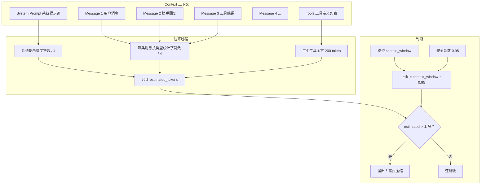

# 04 Token 溢出估算

> 对应源码：`src/ai/overflow.py`

## 先不看代码——用"行李箱容量"来理解

你出远门要带行李箱，箱子有个最大容量（比如 20 寸能装 36 升）。你往里塞衣服、洗漱包、电脑，塞着塞着就要想：还能不能再塞？如果已经塞了 90% 了，再塞一双鞋可能就合不上了。

AI 模型也有一个"行李箱"——叫做**上下文窗口（Context Window）**。它能记住的内容是有限的：

- Claude Sonnet 4.5 的窗口是 200,000 token（约 50 万汉字）
- GPT-4o mini 的窗口是 128,000 token

你跟 AI 对话越长，"行李箱"就越满。塞不下了就必须"丢掉一些旧衣服"（删减历史消息）或者"把衣服压缩打包"（用摘要替代）。

`overflow.py` 的工作就是：**估算当前行李箱用了多少容量，判断还能不能继续装。**

## 概念图



## 源码精读

整个文件不到 100 行，但每个函数都很精炼。

### 核心常量

```python
CHARS_PER_TOKEN = 4              # 粗略估算：平均 4 个字符 ≈ 1 个 token
IMAGE_TOKEN_ESTIMATE = 1000      # 一张图片粗算 1000 token
TOOL_SCHEMA_TOKEN_ESTIMATE = 200 # 一个工具的 JSON Schema 粗算 200 token
```

**为什么是"粗算"？** 因为真正的 token 计算需要用模型专用的分词器（tokenizer），不同模型的分词方式不一样。但在"判断要不要压缩"这个场景下，用字符数除以 4 就够用了——偏差在可接受范围内，而且几乎不消耗性能。

### 估算单条消息的 token

```python
def estimate_message_tokens(msg: Message) -> int:
    total = 0
    
    if isinstance(msg, UserMessage):
        # 用户消息：可能是纯文本，也可能包含图片
        if isinstance(msg.content, str):
            total += len(msg.content)           # 文本直接算字符数
        else:
            for block in msg.content:
                if isinstance(block, TextContent):
                    total += len(block.text)
                elif isinstance(block, ImageContent):
                    total += IMAGE_TOKEN_ESTIMATE * CHARS_PER_TOKEN  # 图片用固定值
    
    elif isinstance(msg, AssistantMessage):
        # 助手消息：可能包含文本、思考过程、工具调用
        for block in msg.content:
            if isinstance(block, TextContent):
                total += len(block.text)
            elif isinstance(block, ThinkingContent):
                total += len(block.thinking)     # 思考过程也占 token
            elif isinstance(block, ToolCall):
                # 工具调用：名称 + 参数的字符数 + 一些固定开销
                total += len(str(block.arguments)) + len(block.name) + 20
    
    elif isinstance(msg, ToolResultMessage):
        # 工具结果：通常是文本，也可能包含图片
        for block in msg.content:
            if isinstance(block, TextContent):
                total += len(block.text)
            elif isinstance(block, ImageContent):
                total += IMAGE_TOKEN_ESTIMATE * CHARS_PER_TOKEN
    
    # 最终：总字符数 / 4 = 估算 token 数（至少 1）
    return max(1, total // CHARS_PER_TOKEN)
```

**代码逻辑拆解**：

- 入参：一条 `Message`（可能是 UserMessage / AssistantMessage / ToolResultMessage）
- 处理：根据消息类型遍历内容块，累加字符数
- 出参：`int`，估算的 token 数

### 估算整个上下文的 token

```python
def estimate_context_tokens(
    messages: list[Message],
    system_prompt: str = "",
    tools: list | None = None,
) -> int:
    # 系统提示词的 token
    total = len(system_prompt) // CHARS_PER_TOKEN
    
    # 所有消息的 token
    for msg in messages:
        total += estimate_message_tokens(msg)
    
    # 工具定义的 token（每个工具固定 200）
    if tools:
        total += len(tools) * TOOL_SCHEMA_TOKEN_ESTIMATE
    
    return total
```

### 判断是否溢出

```python
def is_context_overflow(
    model: Model,
    context: Context,
    *,
    safety_margin: float = 0.95,  # 安全系数：只用 95%，留 5% 给输出
) -> bool:
    limit = int(model.context_window * safety_margin)  # 比如 200000 * 0.95 = 190000
    estimated = estimate_context_tokens(
        context.messages,
        context.system_prompt or "",
        context.tools,
    )
    return estimated > limit  # 超过了就是溢出

def overflow_ratio(model: Model, context: Context) -> float:
    """返回使用率。比如返回 0.8 表示用了 80%。"""
    estimated = estimate_context_tokens(...)
    return estimated / model.context_window
```

**`safety_margin` 为什么是 0.95？** 因为上下文窗口要同时容纳"输入"和"输出"。如果输入就占了 100%，AI 就没有空间写回复了。留 5% 是一个保守的余量。

## 这个模块在哪里被使用？

在 `coding_agent/agent_session.py` 中，每次发送 prompt 之前都会检查是否溢出：

```
用户发消息 → 检查是否溢出 → 如果溢出，用 LLM 生成摘要压缩历史 → 再发送
```

我们会在 `03_编程Agent应用层/04_上下文压缩与重试.md` 详细讲这个流程。

## 小白避坑指南

### 坑 1：为什么不直接用模型的 tokenizer？

确实，每个模型都有自己的分词器（比如 Anthropic 有自己的、OpenAI 有 `tiktoken`）。但：

1. **安装依赖太重**：tokenizer 库通常几十 MB
2. **不同模型不通用**：Claude 和 GPT 的分词方式不同
3. **这里只需要粗略判断**：不是精确计费，只是判断"快满了没"

用 `字符数 / 4` 的误差通常在 20% 以内，对于"是否需要压缩"的判断完全够用。

### 坑 2：`max(1, total // CHARS_PER_TOKEN)` 为什么要 `max(1, ...)`？

防止空消息返回 0。如果一条消息是空的（没有任何内容），`total` 是 0，`0 // 4 = 0`。但一条消息即使是空的，在 API 层面也会占一些 token（角色标签、格式符等），所以至少算 1。

### 坑 3：中文和英文的 token 计算差异

一个重要的事实：**中文一个字通常是 1-2 个 token，而英文一个单词通常是 1-4 个 token。**

所以 `CHARS_PER_TOKEN = 4` 对英文比较准确（一个 token 约 4 个字母），对中文会**低估**（一个汉字就是 1 个字符但可能是 1 个 token）。

但由于 `safety_margin = 0.95` 已经留了余量，这个偏差一般不会造成实际问题。如果你的应用大量使用中文，可以考虑把 `CHARS_PER_TOKEN` 改小（比如 2）。
