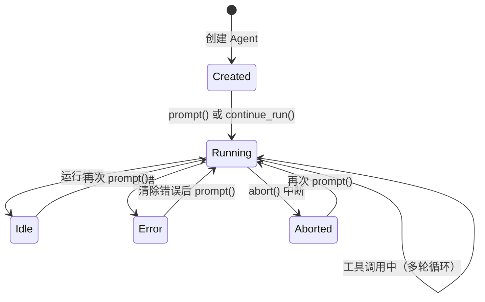

# 01 Agent 对象与生命周期

> 对应源码：`src/agent_core/agent.py`

## 先不看代码——用"餐厅大厨"来理解

想象你去一家高级餐厅。大厨（Agent）有以下职责：

1. **接单**：顾客说"我要一份红烧肉"（用户 prompt）
2. **准备**：大厨脑子里规划——需要五花肉、酱油、糖...（准备上下文）
3. **做菜**：开火、炒糖色、放肉、焖煮...（调用 LLM + 工具）
4. **上菜**：装盘端上桌（返回结果）
5. **记录**：把菜谱记在笔记本上，下次来了还能知道之前做过什么（消息历史）

`Agent` 类就是这个"大厨"的封装。它管理整个"接单→做菜→上菜"的生命周期。

## Agent 的生命周期



## 源码精读

### 1. 创建 Agent 的配置（`AgentOptions`）

```python
@dataclass
class AgentOptions:
    model: Model                    # 必填：用哪个 AI 模型
    system_prompt: str = ""         # 系统提示词："你是一个编程助手"
    tools: list[AgentTool] = ...    # 可用工具列表
    messages: list[AgentMessage] = ... # 初始消息历史（用于恢复会话）
    thinking_level: str = "off"     # 思考模式等级
    tool_execution: str = "parallel" # 工具执行方式：并行 or 串行
    
    # 以下是高级钩子函数（先了解有这回事即可）
    convert_to_llm: ...       # 消息转换函数
    transform_context: ...    # 上下文变换函数
    get_api_key: ...          # API Key 获取函数
    before_tool_call: ...     # 工具调用前的拦截器
    after_tool_call: ...      # 工具调用后的拦截器
    session_id: ...           # 会话 ID
```

### 2. Agent 类的核心结构

```python
class Agent:
    def __init__(self, options: AgentOptions) -> None:
        # 状态对象：记录当前系统提示词、模型、工具、消息历史等
        self._state = AgentState(
            system_prompt=options.system_prompt,
            model=options.model,
            tools=list(options.tools),
            messages=list(options.messages),
        )
        self._options = options
        
        # 事件监听器列表——谁想知道 Agent 在干嘛，就注册一个监听器
        self._listeners: list[AgentEventSink] = []
        
        # 后台任务引用——用于 abort 取消
        self._stream_task: asyncio.Task | None = None
        
        # 消息队列——用于在运行过程中动态注入消息
        self._steering_queue: list[AgentMessage] = []
        self._follow_up_queue: list[AgentMessage] = []
```

**关键理解**：`Agent` 本质上是一个**状态机**，它维护着：
- 当前状态（`AgentState`）：在跑还是空闲？有没有出错？
- 配置（`AgentOptions`）：用什么模型、什么工具、什么钩子
- 监听器（`_listeners`）：谁在听它的事件
- 正在跑的任务（`_stream_task`）：可以中断的后台任务

### 3. prompt 方法——发起对话

```python
async def prompt(self, message: str | UserMessage, images=None) -> list[AgentMessage]:
    # 防止重复调用——一次只能跑一个对话
    if self._state.is_streaming:
        raise RuntimeError("Agent is already running")

    # 把字符串包装成 UserMessage 对象
    if isinstance(message, str):
        content = [TextContent(text=message)]
        for image in images or []:
            content.append(ImageContent(data=image))
        prompt = UserMessage(content=content)
    else:
        prompt = message

    # 启动主循环
    return await self._start_run(prompts=[prompt], continue_mode=False)
```

**入参**：`message` 可以是字符串（最常用），也可以是已经构造好的 `UserMessage`
**出参**：本次对话产生的所有新消息（包括用户消息、助手回复、工具结果等）

### 4. _start_run 方法——真正启动循环的地方

```python
async def _start_run(self, prompts, continue_mode):
    self._state.is_streaming = True   # 标记为"正在运行"
    self._state.error = None          # 清除之前的错误

    # 组装循环配置
    cfg = AgentLoopConfig(
        model=self._state.model,
        convert_to_llm=self._options.convert_to_llm,
        tool_execution=self._options.tool_execution,
        before_tool_call=self._options.before_tool_call,
        after_tool_call=self._options.after_tool_call,
        reasoning=_resolve_reasoning(self._state.thinking_level),
        ...
    )

    # 准备上下文（当前所有消息 + 工具列表）
    context = AgentContext(
        system_prompt=self._state.system_prompt,
        messages=list(self._state.messages),  # 注意：是复制一份，不是直接引用
        tools=list(self._state.tools),
    )

    # 启动后台任务（run_agent_loop 是核心循环，下一篇详细讲）
    self._stream_task = asyncio.create_task(coro)
    try:
        new_messages = await self._stream_task
        self._state.messages.extend(new_messages)  # 把新消息追加到历史
        return new_messages
    except asyncio.CancelledError:
        self._state.error = "aborted"
        raise
    finally:
        self._state.is_streaming = False
        self._stream_task = None
```

### 5. subscribe 方法——事件订阅

```python
def subscribe(self, listener: AgentEventSink) -> Callable[[], None]:
    """订阅 Agent 事件。返回一个"取消订阅"的函数。"""
    self._listeners.append(listener)

    def _unsubscribe():
        if listener in self._listeners:
            self._listeners.remove(listener)

    return _unsubscribe  # 返回取消函数，调用它就取消订阅
```

用法示例：

```python
# 订阅
def on_event(event):
    if event["type"] == "message_update":
        print(event.get("delta", ""), end="")

unsub = agent.subscribe(on_event)

# ... Agent 运行中，on_event 会被反复调用 ...

unsub()  # 不想听了，取消订阅
```

这是经典的**观察者模式**——Agent 是"发布者"，listener 是"订阅者"。

### 6. abort 方法——中断运行

```python
def abort(self) -> None:
    if self._stream_task is not None and not self._stream_task.done():
        self._stream_task.cancel()  # 取消后台任务
```

`asyncio.Task.cancel()` 会让正在 `await` 的地方抛出 `CancelledError`。

## 小白避坑指南

### 坑 1：为什么 prompt 是 `async` 函数？

因为 Agent 需要做网络请求（调用 LLM API），网络请求是 I/O 操作。在 Python 中，I/O 操作推荐用异步方式——这样在等待网络回复时，程序可以去做别的事情，不会"卡死"。

```python
# 调用方式必须在 async 函数中
async def main():
    agent = Agent(options)
    result = await agent.prompt("你好")  # await 等待结果

asyncio.run(main())  # 运行异步主函数
```

### 坑 2：`list(options.tools)` 为什么要复制？

```python
self._state.tools = list(options.tools)  # 创建一个新列表
```

而不是 `self._state.tools = options.tools`（直接引用同一个列表）。这是为了**隔离**：如果外面修改了 `options.tools`，不会影响 Agent 内部已经在用的工具列表。这是防御性编程的好习惯。

### 坑 3：`_steering_queue` 和 `_follow_up_queue` 有什么区别？

- `steering_queue`（导向消息）：在 AI 正在想的时候插入的消息，影响当前这一轮的思考。比如"注意要用中文回答"
- `follow_up_queue`（后续消息）：在 AI 回答完一轮后，自动追加的消息，触发新一轮。比如自动追问"还有其他建议吗？"

这两个在日常使用中不常用，但在 IM 桥接场景中很有用——当用户在 Agent 还没回答完时又发了新消息，就可以放进 `steering_queue`。
