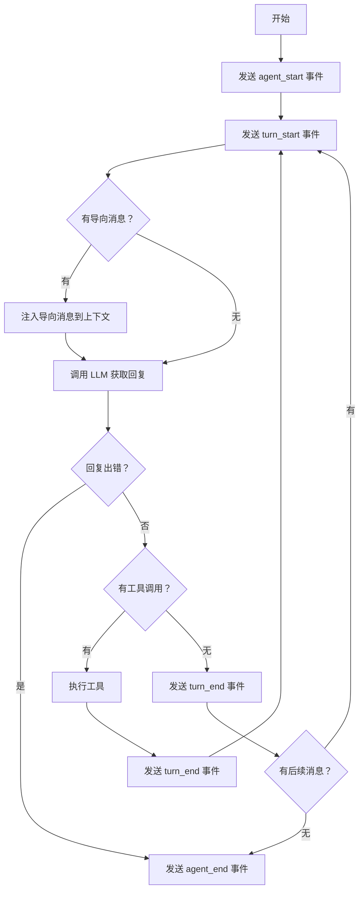

# 02 主循环详解

> 对应源码：`src/agent_core/agent_loop.py`

## 先不看代码——用"客服处理工单"来理解

想象一个智能客服系统：

1. 用户提了一个问题："帮我查一下订单 12345 的物流状态"
2. 客服（AI）看到问题后想了想，说："我需要先查询物流系统"
3. 系统自动去查物流系统（工具调用），查到结果后告诉客服
4. 客服拿到物流信息，又想了想，说："我还需要查一下是否有异常"
5. 系统又去查异常记录...
6. 最终客服有了所有信息，给用户一个完整的回答

这个"提问→思考→调工具→拿结果→再思考→..."的过程，就是 **Agent Loop（主循环）**。循环在"AI 不再需要调用工具"时结束。

## 主循环的核心流程



**一句话总结**：主循环就是一个 `while True`，每轮问 LLM 一次，如果 LLM 说"我要用工具"，就执行工具并继续循环；如果 LLM 说"我想好了"，就结束。

## 源码精读

### 1. 入口函数 `run_agent_loop`

```python
async def run_agent_loop(
    prompts: list[AgentMessage],    # 用户的输入消息
    context: AgentContext,          # 当前上下文（历史+工具）
    config: AgentLoopConfig,        # 循环配置
    emit: AgentEventSink,           # 事件发射器
    signal: Any | None = None,      # 中断信号
    stream_fn: StreamFn | None = None,  # 可注入的流式函数（用于测试）
) -> list[AgentMessage]:
    # 1. 给事件加上 runId/turnId 等元数据
    emit = _with_event_schema(emit, config.session_id)
    
    # 2. 准备新消息列表（会记录本次运行产生的所有消息）
    new_messages: list[AgentMessage] = list(prompts)
    
    # 3. 把用户消息追加到上下文
    current_context = AgentContext(
        system_prompt=context.system_prompt,
        messages=[*context.messages, *prompts],  # 历史 + 新消息
        tools=context.tools,
    )

    # 4. 发送开始事件 + 用户消息事件
    await _emit(emit, {"type": "agent_start"})
    await _emit(emit, {"type": "turn_start"})
    for prompt in prompts:
        await _emit(emit, {"type": "message_start", "message": prompt})
        await _emit(emit, {"type": "message_end", "message": prompt})

    # 5. 进入真正的循环
    await _run_loop(current_context, new_messages, config, emit, signal, stream_fn)
    return new_messages
```

### 2. 核心循环 `_run_loop`——最重要的函数

```python
async def _run_loop(current_context, new_messages, config, emit, signal, stream_fn):
    first_turn = True
    # 先检查有没有"导向消息"（可以在运行前注入）
    pending_messages = await _maybe_await(
        config.get_steering_messages()
    ) if config.get_steering_messages else []

    while True:
        has_more_tool_calls = True

        while has_more_tool_calls or pending_messages:
            # --- 每轮开始 ---
            if not first_turn:
                await _emit(emit, {"type": "turn_start"})
            else:
                first_turn = False

            # 如果有待注入的消息，先塞进上下文
            if pending_messages:
                for message in pending_messages:
                    current_context.messages.append(message)
                    new_messages.append(message)
                pending_messages = []

            # *** 核心：调用 LLM 获取助手回复 ***
            assistant = await _stream_assistant_response(
                current_context, config, emit, signal, stream_fn
            )
            new_messages.append(assistant)

            # 如果回复出错或被中断，直接结束
            if assistant.stop_reason in {"error", "aborted"}:
                await _emit(emit, {"type": "agent_end", "messages": new_messages})
                return

            # 检查回复中有没有工具调用
            tool_calls = [c for c in assistant.content if isinstance(c, ToolCall)]
            has_more_tool_calls = len(tool_calls) > 0

            if has_more_tool_calls:
                # *** 核心：执行工具 ***
                tool_results = await _execute_tool_calls(
                    current_context, assistant, config, emit, signal
                )
                # 把工具结果追加到上下文（LLM 下一轮能看到）
                for result in tool_results:
                    current_context.messages.append(result)
                    new_messages.append(result)

            # 每轮结束，再检查有没有新的导向消息
            pending_messages = await _maybe_await(
                config.get_steering_messages()
            ) if config.get_steering_messages else []

        # 外层循环：检查有没有后续消息
        followups = await _maybe_await(
            config.get_follow_up_messages()
        ) if config.get_follow_up_messages else []
        if followups:
            pending_messages = followups
            continue  # 有后续消息就继续循环
        break  # 没有就彻底结束

    await _emit(emit, {"type": "agent_end", "messages": new_messages})
```

### 3. 调用 LLM 获取回复 `_stream_assistant_response`

```python
async def _stream_assistant_response(context, config, emit, signal, stream_fn):
    messages = context.messages
    
    # 可选：在发送给 LLM 之前，变换上下文（比如裁剪过长的消息）
    if config.transform_context:
        messages = await _maybe_await(config.transform_context(messages, signal))

    # 消息格式转换（从 Agent 消息格式转成 LLM 需要的格式）
    llm_messages = await _maybe_await(config.convert_to_llm(messages))
    llm_context = Context(
        system_prompt=context.system_prompt,
        messages=llm_messages,
        tools=context.tools,
    )

    # 拿 API Key
    resolved_api_key = config.get_api_key and await _maybe_await(
        config.get_api_key(config.model.provider)
    )
    options = SimpleStreamOptions(reasoning=config.reasoning, api_key=resolved_api_key)

    # 调用流式接口（默认用 ai.stream.stream_simple，测试时可注入 mock）
    fn = stream_fn or stream_simple
    response_stream = await _maybe_await(fn(config.model, llm_context, options))

    # 消费流式事件，同时更新上下文中的消息
    async for event in response_stream:
        t = event.get("type")
        if t == "start":
            partial = event["partial"]
            context.messages.append(partial)       # 占位
            await _emit(emit, {"type": "message_start", "message": partial})
        elif t in {"text_delta", "thinking_delta", "toolcall_delta", ...}:
            partial = event["partial"]
            context.messages[-1] = partial          # 更新占位消息
            await _emit(emit, {"type": "message_update", ...})
        elif t in {"done", "error"}:
            final_message = await response_stream.result()
            context.messages[-1] = final_message    # 替换为最终消息
            await _emit(emit, {"type": "message_end", "message": final_message})
            return final_message
```

**关键理解**：流式过程中，`context.messages[-1]` 会被不断更新。从一个空的"半成品"逐渐变成完整的 `AssistantMessage`——就像你在微信上看到对方"正在输入..."的效果。

### 4. 事件元数据包装 `_with_event_schema`

```python
def _with_event_schema(emit, session_id):
    """给每个事件自动添加 runId、turnId、eventId、timestamp 等元数据。"""
    run_id = f"run_{uuid.uuid4().hex[:12]}"  # 每次运行的唯一 ID
    turn_id = 0         # 当前轮次
    event_seq = 0       # 事件序号

    async def _wrapped(event):
        nonlocal turn_id, event_seq
        if event.get("type") == "turn_start":
            turn_id += 1        # 遇到 turn_start，轮次 +1

        event_seq += 1
        enriched = {
            **event,                           # 保留原始事件
            "runId": run_id,                   # 添加运行 ID
            "turnId": turn_id,                 # 添加轮次号
            "eventId": f"{run_id}:{event_seq}",# 添加事件 ID
            "timestamp": _now_ms(),            # 添加时间戳
            "sessionId": session_id,           # 添加会话 ID
        }
        await _maybe_await(emit(enriched))

    return _wrapped
```

这里用了 **闭包**（closure）——`_wrapped` 函数"记住了"外部的 `run_id`、`turn_id` 等变量，每次调用时都能访问和修改它们。

## 一次完整执行的时序图

```mermaid
sequenceDiagram
    participant Agent
    participant Loop as agent_loop
    participant LLM as AI模型
    participant Tool as 工具

    Agent->>Loop: run_agent_loop(prompts)
    Loop->>Loop: emit(agent_start)
    Loop->>Loop: emit(turn_start)
    
    Loop->>LLM: stream_simple(model, context)
    LLM-->>Loop: text_delta（流式文本）
    LLM-->>Loop: toolcall_end（需要调工具）
    Loop->>Loop: emit(message_end)
    
    Loop->>Tool: execute(read_file, {path: "main.py"})
    Tool-->>Loop: AgentToolResult（文件内容）
    Loop->>Loop: emit(tool_execution_end)
    Loop->>Loop: emit(turn_end)
    
    Loop->>Loop: emit(turn_start)（新一轮）
    Loop->>LLM: stream_simple（带上工具结果）
    LLM-->>Loop: text_delta（最终回复）
    LLM-->>Loop: done（stop_reason=stop）
    Loop->>Loop: emit(message_end)
    Loop->>Loop: emit(turn_end)
    Loop->>Loop: emit(agent_end)
    
    Loop-->>Agent: 返回 new_messages
```

## 小白避坑指南

### 坑 1：`while True` 不会死循环吗？

不会。循环的退出条件是：`has_more_tool_calls` 为 `False`（AI 没有更多工具要调）且 `pending_messages` 为空（没有待注入的消息）。只要 AI 给出一个不包含 ToolCall 的回复，循环就结束了。

但如果 AI 一直要求调用工具怎么办？理论上确实可能。这就是为什么上层会有 `abort()` 机制和超时控制。

### 坑 2：`nonlocal` 关键字是什么意思？

```python
turn_id = 0

async def _wrapped(event):
    nonlocal turn_id  # 告诉 Python：我要修改外层函数的 turn_id，不是创建新变量
    turn_id += 1
```

没有 `nonlocal`，Python 会认为 `turn_id` 是一个新的局部变量，`+= 1` 就会报错"用了未定义的变量"。

### 坑 3：`stream_fn` 参数为什么存在？

```python
fn = stream_fn or stream_simple
```

这是**依赖注入**的体现。正式运行时 `stream_fn` 是 `None`，用的是真实的 `stream_simple`。但在测试中，可以传入一个 mock 函数来模拟 LLM 的回复，不需要真的调用 API。

看看测试文件 `test_agent_core_loop.py`，里面就有大量这样的用法。
