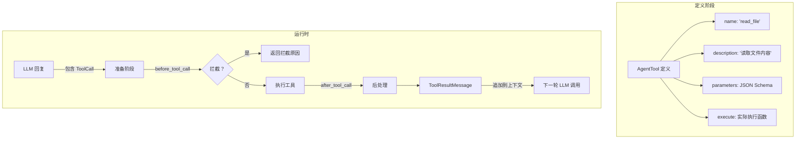

# 03 工具协议与执行策略

> 对应源码：`src/agent_core/types.py`（工具定义）、`src/agent_core/agent_loop.py`（工具执行）

## 先不看代码——用"外卖骑手的装备包"来理解

外卖骑手出发前要确认自己有哪些装备：保温箱、雨衣、手机导航、取餐袋。每个装备都有明确的用途和使用方法。

AI Agent 也一样，出发前要告诉它："你有这些工具可以用"。每个工具需要三样东西：

1. **名字**：比如 `read_file`（读文件）
2. **说明**：告诉 AI 这个工具干什么、什么时候用
3. **参数定义**：这个工具需要传什么参数（用 JSON Schema 描述）
4. **执行函数**：真正执行操作的代码

当 AI 觉得它需要某个工具时，它会生成一个 `ToolCall`（工具调用指令），Agent 循环就会找到对应的工具并执行。

## 工具系统的整体流程



## 源码精读

### 1. 工具定义（`types.py`）

```python
@dataclass
class AgentToolResult:
    """工具执行后的产物。"""
    content: list[TextContent | ImageContent]  # 结果内容（文本或图片）
    details: Any = None                         # 额外细节（给 UI/日志用）


class ToolExecuteFn(Protocol):
    """工具执行函数的签名规范（Protocol = 接口约束）。"""
    def __call__(
        self,
        tool_call_id: str,          # 本次调用的唯一 ID
        params: dict[str, Any],     # AI 传来的参数
        signal: Any | None = None,  # 中断信号
        on_update: ... | None = None, # 进度回调（可选）
    ) -> Awaitable[AgentToolResult] | AgentToolResult:
        ...
    # 返回值可以是同步的 AgentToolResult，也可以是异步的


@dataclass
class AgentTool:
    """一个完整的工具定义。"""
    name: str                    # 工具名，如 "read_file"
    label: str                   # 显示标签，如 "Read File"
    description: str             # 给 AI 看的说明
    parameters: dict[str, Any]   # JSON Schema 格式的参数定义
    execute: ToolExecuteFn       # 执行函数
```

**JSON Schema 参数定义示例**：

```python
AgentTool(
    name="read_file",
    label="Read File",
    description="读取指定路径的文件内容",
    parameters={
        "type": "object",
        "properties": {
            "path": {"type": "string", "description": "文件路径"},
            "offset": {"type": "integer", "description": "起始行号（可选）"},
        },
        "required": ["path"],           # path 是必填的
        "additionalProperties": False,  # 不允许额外参数
    },
    execute=read_file_tool,
)
```

AI 看到这个定义后，就知道："噢，有个叫 read_file 的工具，我需要传一个 path 参数，就能读到文件内容。"

### 2. 工具执行前的拦截（before_tool_call）

```python
@dataclass
class BeforeToolCallContext:
    assistant_message: AssistantMessage  # AI 的回复消息
    tool_call: ToolCall                  # 要执行的工具调用
    args: dict[str, Any]                 # 参数
    context: AgentContext                # 当前上下文

@dataclass
class BeforeToolCallResult:
    block: bool = False      # 是否拦截（True = 不执行）
    reason: str | None = None  # 拦截原因
```

在 `agent_loop.py` 中的使用：

```python
async def _prepare_tool_call(context, assistant_message, tool_call, config, signal):
    # 1. 在工具列表中查找对应的工具
    tool = next((t for t in context.tools if t.name == tool_call.name), None)
    if tool is None:
        return None, _error_tool_result(f"Tool {tool_call.name} not found"), True

    args = tool_call.arguments if isinstance(tool_call.arguments, dict) else {}

    # 2. 如果有 before_tool_call 钩子，先调用它
    if config.before_tool_call:
        before = await _maybe_await(
            config.before_tool_call(
                BeforeToolCallContext(
                    assistant_message=assistant_message,
                    tool_call=tool_call,
                    args=args,
                    context=context,
                ),
                signal,
            )
        )
        # 如果钩子说"拦截"，工具就不执行
        if before and before.block:
            return None, _error_tool_result(before.reason or "Tool execution was blocked"), True

    return _PreparedToolCall(tool_call=tool_call, tool=tool, args=args), ..., False
```

**实际用途**：`coding_agent` 用 `before_tool_call` 来拦截危险的 bash 命令（比如 `rm -rf /`）。

### 3. 串行 vs 并行执行

```python
async def _execute_tool_calls(context, assistant_message, config, emit, signal):
    tool_calls = [c for c in assistant_message.content if isinstance(c, ToolCall)]
    
    if config.tool_execution == "sequential":
        # 串行：一个一个执行
        return await _execute_tool_calls_sequential(...)
    # 并行：同时执行所有工具
    return await _execute_tool_calls_parallel(...)
```

**串行执行**：

```python
async def _execute_tool_calls_sequential(context, assistant, tool_calls, config, emit, signal):
    results = []
    for tool_call in tool_calls:                # 一个一个来
        prepared, immediate, is_error = await _prepare_tool_call(...)
        if prepared is None:
            results.append(...)                  # 拦截了就跳过
            continue
        executed = await _execute_prepared_tool_call(prepared, emit, signal)  # 执行
        results.append(await _finalize_executed_tool_call(...))               # 后处理
    return results
```

**并行执行**：

```python
async def _execute_tool_calls_parallel(context, assistant, tool_calls, config, emit, signal):
    # 1. 先准备所有工具调用（检查是否存在、是否被拦截）
    prepared_calls = []
    for tool_call in tool_calls:
        prepared, immediate, is_error = await _prepare_tool_call(...)
        if prepared is not None:
            prepared_calls.append(prepared)

    # 2. 用 asyncio.gather 同时执行所有工具
    tasks = [asyncio.create_task(_execute_prepared_tool_call(pc, emit, signal))
             for pc in prepared_calls]
    executed_results = await asyncio.gather(*tasks)  # 并行等待所有任务

    # 3. 逐个后处理
    finalized = []
    for prepared, executed in zip(prepared_calls, executed_results):
        finalized.append(await _finalize_executed_tool_call(...))
    return finalized
```

**类比**：想象你有 3 个快递要寄——

- 串行 = 先去菜鸟驿站寄第一个，寄完再去寄第二个，再寄第三个
- 并行 = 同时叫 3 个同事帮你分头去寄，大家一起完成

**什么时候用哪种？**
- 并行（默认）：大多数工具互不影响，比如同时读 3 个不同的文件
- 串行：工具之间有依赖关系，比如"先创建目录，再往里写文件"

### 4. 工具执行后的后处理（after_tool_call）

```python
async def _finalize_executed_tool_call(context, assistant, prepared, executed, config, emit, signal):
    result = executed.result
    is_error = executed.is_error

    # 如果有 after_tool_call 钩子，可以修改结果
    if config.after_tool_call:
        after = await _maybe_await(
            config.after_tool_call(
                AfterToolCallContext(
                    assistant_message=assistant,
                    tool_call=prepared.tool_call,
                    args=prepared.args,
                    result=result,
                    is_error=is_error,
                    context=context,
                ),
                signal,
            )
        )
        if after:
            if after.content is not None:
                result.content = after.content    # 可以替换内容
            if after.is_error is not None:
                is_error = after.is_error          # 可以覆盖错误状态

    # 组装成 ToolResultMessage 返回
    return ToolResultMessage(
        tool_call_id=prepared.tool_call.id,
        tool_name=prepared.tool_call.name,
        content=result.content,
        is_error=is_error,
    )
```

## 自己写一个工具的完整示例

```python
from agent_core import AgentTool, AgentToolResult
from ai.types import TextContent

async def my_weather_tool(tool_call_id, params, signal=None, on_update=None):
    """获取天气信息（示例工具）。"""
    city = params.get("city", "北京")
    
    # 可选：推送进度更新
    if on_update:
        on_update(AgentToolResult(
            content=[TextContent(text=f"正在查询 {city} 的天气...")],
        ))
    
    # 实际工作（这里用假数据）
    weather = f"{city}今天晴，25°C"
    
    return AgentToolResult(
        content=[TextContent(text=weather)],
        details={"city": city, "source": "mock"},
    )

weather_tool = AgentTool(
    name="get_weather",
    label="Get Weather",
    description="查询指定城市的天气信息",
    parameters={
        "type": "object",
        "properties": {
            "city": {"type": "string", "description": "城市名称"}
        },
        "required": ["city"],
        "additionalProperties": False,
    },
    execute=my_weather_tool,
)
```

## 小白避坑指南

### 坑 1：`Protocol` 是什么？跟 `class` 有什么区别？

```python
class ToolExecuteFn(Protocol):
    def __call__(self, tool_call_id, params, signal=None, on_update=None): ...
```

`Protocol` 来自 `typing` 模块，它定义了一个"接口规范"——任何函数，只要签名匹配（参数名和类型对得上），就算实现了这个协议。不需要显式继承。

这是 Python 的"鸭子类型"思想：看起来像鸭子、叫起来像鸭子，那就是鸭子。

### 坑 2：工具函数可以是同步的吗？

可以！看 `_maybe_await` 这个辅助函数：

```python
async def _maybe_await(value):
    if asyncio.isfuture(value) or asyncio.iscoroutine(value):
        return await value  # 如果是异步的，等它完成
    return value             # 如果是同步的，直接返回
```

所以你写的工具函数可以是 `async def`（异步），也可以是普通 `def`（同步），系统都能处理。

### 坑 3：`asyncio.gather` 是什么？

```python
results = await asyncio.gather(task1, task2, task3)
```

`asyncio.gather` 同时运行多个异步任务，等所有任务都完成后，返回一个结果列表。就像你同时下了 3 个外卖单，`gather` 会等所有外卖都送到后才算完成。
