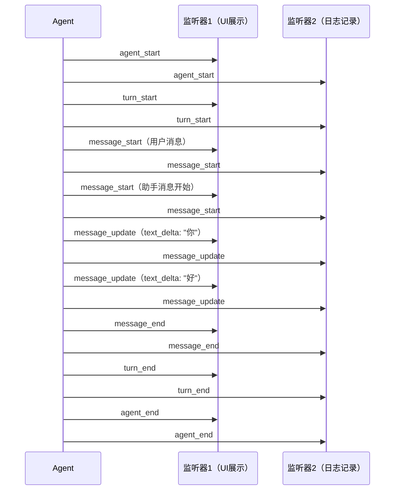

# 04 事件驱动架构

> 对应源码：`src/agent_core/types.py`（事件类型定义）、`src/agent_core/agent.py`（事件分发）

## 先不看代码——用"广播电台"来理解

想象一个广播电台在直播：

- **电台主播**（Agent）不断播报内容："现在播报天气预报...正在查询中...结果是晴天25度..."
- **收音机**（监听器/Listener）随时可以开启或关闭——开着就能听到，关了就听不到
- 不同的人拿着不同的收音机：有的人只关心"最终结果"，有的人想听全程直播
- 电台广播的内容有固定格式：每条消息都有"类型"、"时间戳"、"内容"

在 LiaoClaw 中：
- Agent 运行过程中会产生各种**事件**（开始、文本更新、工具调用、结束...）
- 任何组件都可以**订阅**这些事件，实时了解 Agent 在干什么
- 这种模式叫做**发布-订阅模式（Pub-Sub）**

## 事件流的时间线



## 源码精读

### 1. 事件类型定义（`types.py`）

所有事件都继承自 `AgentEventBase`，共享以下元数据字段：

```python
class AgentEventBase(TypedDict):
    type: str              # 事件类型名
    runId: str             # 本次运行的唯一 ID
    turnId: int            # 当前轮次号（从 1 开始）
    eventId: str           # 事件的唯一 ID（run_xxx:序号）
    timestamp: int         # 毫秒时间戳
    sessionId: str | None  # 会话 ID
```

**完整事件类型表**：

| 事件类型 | 类名 | 含义 | 携带数据 |
|---------|------|------|---------|
| `agent_start` | `AgentStartEvent` | Agent 开始运行 | - |
| `agent_end` | `AgentEndEvent` | Agent 运行结束 | `messages`（所有新消息） |
| `turn_start` | `TurnStartEvent` | 新一轮开始 | - |
| `turn_end` | `TurnEndEvent` | 一轮结束 | `message`（助手消息）、`toolResults` |
| `message_start` | `MessageStartEvent` | 一条消息开始 | `message` |
| `message_update` | `MessageUpdateEvent` | 消息更新（流式） | `message`、`assistantMessageEvent` |
| `message_end` | `MessageEndEvent` | 一条消息结束 | `message` |
| `tool_execution_start` | `ToolExecutionStartEvent` | 工具开始执行 | `toolName`、`args` |
| `tool_execution_update` | `ToolExecutionUpdateEvent` | 工具执行中更新 | `partialResult` |
| `tool_execution_end` | `ToolExecutionEndEvent` | 工具执行结束 | `result`、`isError` |
| `error` | `ErrorEvent` | 错误发生 | `error`（错误信息） |

```python
# 所有事件类型的联合
AgentEvent = (
    AgentStartEvent | AgentEndEvent
    | TurnStartEvent | TurnEndEvent
    | MessageStartEvent | MessageUpdateEvent | MessageEndEvent
    | ToolExecutionStartEvent | ToolExecutionUpdateEvent | ToolExecutionEndEvent
    | ErrorEvent
)

# 事件处理函数的类型签名
AgentEventSink = Callable[[AgentEvent], None | Awaitable[None]]
```

### 2. 事件的分发（`agent.py`）

```python
class Agent:
    async def _dispatch_event(self, event: AgentEvent) -> None:
        """接收到事件后，做两件事：更新自身状态 + 通知所有监听器。"""
        event_type = event.get("type")

        # 第一件事：根据事件类型更新 Agent 自身的状态
        if event_type == "message_start":
            self._state.stream_message = event.get("message")  # 记录正在流的消息
        elif event_type == "message_update":
            self._state.stream_message = event.get("message")  # 更新流中消息
        elif event_type == "message_end":
            self._state.stream_message = None                   # 流完了
        elif event_type == "tool_execution_start":
            tool_call_id = event.get("toolCallId")
            self._state.pending_tool_calls.add(tool_call_id)    # 记录正在执行的工具
        elif event_type == "tool_execution_end":
            tool_call_id = event.get("toolCallId")
            self._state.pending_tool_calls.discard(tool_call_id) # 工具执行完了

        # 第二件事：通知所有监听器
        for listener in list(self._listeners):  # 用 list() 复制，防止迭代中修改
            await _maybe_await(listener(event))
```

**`list(self._listeners)`** 为什么要复制？因为某个 listener 可能在处理事件时取消自己的订阅（调用 `unsubscribe`），如果直接遍历 `self._listeners`，会导致"遍历过程中列表被修改"的错误。

### 3. 事件的订阅与取消

```python
def subscribe(self, listener: AgentEventSink) -> Callable[[], None]:
    self._listeners.append(listener)

    def _unsubscribe():
        if listener in self._listeners:
            self._listeners.remove(listener)

    return _unsubscribe
```

**设计亮点**：`subscribe` 返回的是一个函数（`_unsubscribe`），调用这个函数就能取消订阅。这比"记住 listener 的 ID 再调 unsubscribe(id)"要简洁得多。

### 4. 实际使用场景

**场景 1：CLI 交互模式——打印流式输出**

```python
def on_event(event):
    if event.get("type") == "message_update":
        assistant_event = event.get("assistantMessageEvent", {})
        if assistant_event.get("type") == "text_delta":
            print(assistant_event["delta"], end="", flush=True)

agent.subscribe(on_event)
await agent.prompt("你好")
```

**场景 2：IM 桥接——流式更新飞书卡片**

```python
async def on_event(event):
    if event.get("type") == "message_update":
        msg = event.get("message")
        text = "".join(b.text for b in msg.content if isinstance(b, TextContent))
        adapter.update_text(placeholder_id, text)  # PATCH 更新飞书消息

unsub = session.subscribe(on_event)
await session.prompt(user_text)
unsub()
```

**场景 3：会话持久化——把事件写入磁盘**

```python
def on_event(event):
    with open("events.jsonl", "a") as f:
        f.write(json.dumps(event) + "\n")

agent.subscribe(on_event)
```

## 事件的嵌套结构

一次完整的 Agent 运行，事件的嵌套关系是这样的：

```
agent_start
├── turn_start (第1轮)
│   ├── message_start (用户消息)
│   ├── message_end
│   ├── message_start (助手消息)
│   ├── message_update (text_delta)
│   ├── message_update (toolcall_delta)
│   ├── message_end
│   ├── tool_execution_start
│   ├── tool_execution_end
│   ├── message_start (ToolResultMessage)
│   ├── message_end
│   └── turn_end
├── turn_start (第2轮)
│   ├── message_start (助手消息)
│   ├── message_update (text_delta)
│   ├── message_end
│   └── turn_end
└── agent_end
```

## 小白避坑指南

### 坑 1：TypedDict 和 dataclass 有什么区别？

事件用 `TypedDict`，消息用 `dataclass`——为什么不统一？

- `TypedDict` 本质上就是一个 `dict`，序列化（转 JSON）时直接就是字典，不需要额外处理
- `dataclass` 是一个对象，有方法、有属性访问，但序列化时需要 `asdict()` 转换

事件是"临时的、一次性的、需要频繁序列化"的东西，用字典更方便。消息是"长期存在、需要类型安全"的数据，用 dataclass 更合适。

### 坑 2：事件监听器里能做耗时操作吗？

理论上可以，但**不推荐**。因为 `_dispatch_event` 是 `await` 每个 listener 的——如果某个 listener 执行太慢，会阻塞整个事件流。

如果确实需要做耗时操作（比如写数据库），建议在 listener 里只把事件放入队列，用另一个任务异步消费。

### 坑 3：`AgentEventSink` 类型怎么理解？

```python
AgentEventSink = Callable[[AgentEvent], None | Awaitable[None]]
```

翻译成大白话：**AgentEventSink 是一个函数，它接收一个事件（AgentEvent），可以不返回任何东西（None），也可以返回一个异步等待（Awaitable[None]）。**

也就是说，你的监听函数可以是同步的 `def`，也可以是异步的 `async def`，系统都会正确处理。
