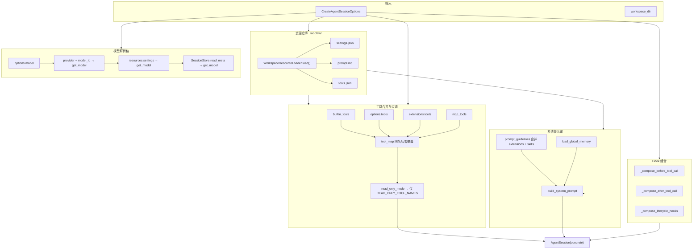

# 会话工厂与资源加载：在「总装车间」里拼出一台编程 Agent

> 对应源码：`src/coding_agent/factory.py`、`src/coding_agent/resources.py`

## 先不看代码——用「在工厂里从零组装一台机器人」来理解

想象你走进一座**总装车间**：传送带上摆着大脑（模型）、工具箱（内置/扩展/MCP 工具）、说明书（系统提示词）、安全护栏（只读模式、危险命令拦截）和若干**外挂模块**（extensions、skills）。`create_agent_session` 就是这条流水线的**最后一道工序**——它不负责发明零件，而是按既定顺序把零件拧到一起，最后通电试跑，交出一台可用的 `AgentSession`。

车间里还有一间**零件仓库**，也就是工作区下的 `.liaoclaw/` 目录。`WorkspaceResourceLoader` 像仓库管理员，专门读取 `settings.json`（运行参数与模型配置）、`prompt.md`（默认系统提示词）、`tools.json`（启用哪些内置工具）。这些文件若存在，就像给流水线贴上「默认配方」；而你在代码里传入的 `CreateAgentSessionOptions` 则像**领班下的临时工单**——多数时候工单可以覆盖仓库里的默认值，从而实现「同一套代码，不同项目不同行为」。

装配顺序里最容易被忽略的是**优先级与合并规则**：内置工具先铺底，再用你传入的 `options.tools` 覆盖同名项，接着是扩展和 MCP 工具继续覆盖。若开启只读模式，流水线末端还会过一道安检，把「会改文件、能执行 shell」的工具统统拦下。Hooks（before/after tool、prompt 生命周期）则像机器人身上的**传感器与回调插槽**：基础钩子来自调用方，扩展里加载的钩子按顺序接在后面，形成一条可中断、可改写结果的责任链。

## 装配流水线总览（Mermaid）



## 源码精读

### `WorkspaceResourceLoader`：从 `.liaoclaw` 读入三类配置

```python
# resources.py — 核心思路：固定路径 + 安全解析，坏 JSON 不炸进程

class WorkspaceResourceLoader:
    def __init__(self, workspace_dir: str | Path) -> None:
        self.workspace_dir = Path(workspace_dir)
        self.resource_root = self.workspace_dir / ".liaoclaw"  # 「仓库」根目录
        self.settings_file = self.resource_root / "settings.json"
        self.prompt_file = self.resource_root / "prompt.md"
        self.tools_file = self.resource_root / "tools.json"

    def load(self) -> WorkspaceResources:
        # 一次 load 得到三样东西：结构化设置、提示词文本、启用的内置工具名列表
        return WorkspaceResources(
            settings=self._load_settings(),
            prompt=self._load_prompt(),
            enabled_tools=self._load_tools(),
        )

    def _load_tools(self) -> Optional[list[str]]:
        # tools.json 约定：{"enabled": ["read", "grep", ...]}，非列表则视为无效
        raw = self._safe_load_json(self.tools_file)
        if not isinstance(raw, dict):
            return None
        enabled = raw.get("enabled")
        if not isinstance(enabled, list):
            return None
        return [item for item in enabled if isinstance(item, str)]
```

### `create_agent_session`：模型解析链与工具合并

```python
# factory.py — 模型解析：显式 model > provider+model_id > 工作区设置 > 已存会话 meta

model = options.model
if model is None and options.provider and options.model_id:
    model = get_model(options.provider, options.model_id)
if model is None and resources and resources.settings.provider and resources.settings.model_id:
    model = get_model(resources.settings.provider, resources.settings.model_id)
if model is None and restored_meta:
    p = restored_meta.get("provider")
    mid = restored_meta.get("model_id")
    if isinstance(p, str) and isinstance(mid, str):
        model = get_model(p, mid)
if model is None:
    raise ValueError("Unable to resolve model: ...")
```

```python
# factory.py — 工具合并：字典 keyed by name，后写入者覆盖先写入者
# 顺序：内置 → options.tools → extensions → MCP

builtin_tools = create_builtin_tools(
    workspace,
    enabled_names=builtin_enabled,  # 可能来自 tools.json 的 enabled 列表
    block_dangerous_bash=block_dangerous_bash,
    # ...
)

tool_map = {tool.name: tool for tool in builtin_tools}
for tool in options.tools:
    tool_map[tool.name] = tool
for tool in loaded_extensions.tools:
    tool_map[tool.name] = tool
for tool in mcp_tools:
    tool_map[tool.name] = tool
merged_tools = list(tool_map.values())

# 只读模式：最终只保留「只读工具名」白名单内的工具
if read_only_mode:
    merged_tools = [tool for tool in merged_tools if tool.name in READ_ONLY_TOOL_NAMES]
```

```python
# factory.py — Hook 组合：base 在前，扩展 hooks 在后；before 链遇 block 即短路

def _compose_before_tool_call(base, hooks):
    chain = []
    if base:
        chain.append(base)
    chain.extend(hooks)
    # ...
    async def _runner(ctx, signal):
        for hook in chain:
            result = hook(ctx, signal)
            if inspect.isawaitable(result):
                result = await result
            if result and result.block:
                return result
        return None
    return _runner
```

```python
# factory.py — 系统提示词：guidelines 合并顺序 = 配置 + 扩展 + skills（含诊断行）

prompt_guidelines = [
    *(prompt_guidelines or []),
    *loaded_extensions.prompt_guidelines,
    *loaded_skills.prompt_guidelines,
]
prompt_guidelines.extend([f"[skill-diagnostic] {d}" for d in loaded_skills.diagnostics])

system_prompt = build_system_prompt(
    SystemPromptBuildOptions(
        custom_prompt=system_prompt or None,
        selected_tools=_canonical_tool_names(merged_tools),  # 别名规范化为 ls/read/write
        tool_snippets=tool_snippets,
        prompt_guidelines=prompt_guidelines,
        append_system_prompt=append_system_prompt,
        memory_text=memory_text,
        cwd=workspace,
    )
)
```

## 小白避坑指南

1. **以为改了 `settings.json` 就一定会生效**  
   若创建会话时 `load_workspace_resources=False`，或你显式传了 `model`/`system_prompt` 等，工厂会**跳过或覆盖**磁盘上的默认值。排查时先看 `CreateAgentSessionOptions` 里是否「写死」了高层参数。

2. **工具同名却「莫名其妙」用了另一份实现**  
   合并规则是**后者覆盖前者**：MCP 与扩展若注册了与内置相同的 `name`，最终只会保留最后写入 `tool_map` 的那一份。需要固定行为时，要么改名，要么控制加载顺序与来源。

3. **只读模式只拦内置语义，不自动保证「绝对只读」**  
   `read_only_mode` 仅按 `READ_ONLY_TOOL_NAMES` 过滤；若你通过 `options.tools` 自行塞入会写盘或执行命令的自定义工具，且名称不在白名单逻辑预期内，仍可能绕过「只读」意图。自定义工具时要自己守边界。

4. **忽略 `_canonical_tool_names` 与别名的关系**  
   构建系统提示词时会把 `list_dir`/`read_file`/`write_file` 规范成 `ls`/`read`/`write`。若你在 prompt 或文档里只提别名，可能对「模型实际看到的工具清单」产生错觉，调试时以合并后的 `merged_tools` 与 canonical 列表为准。
