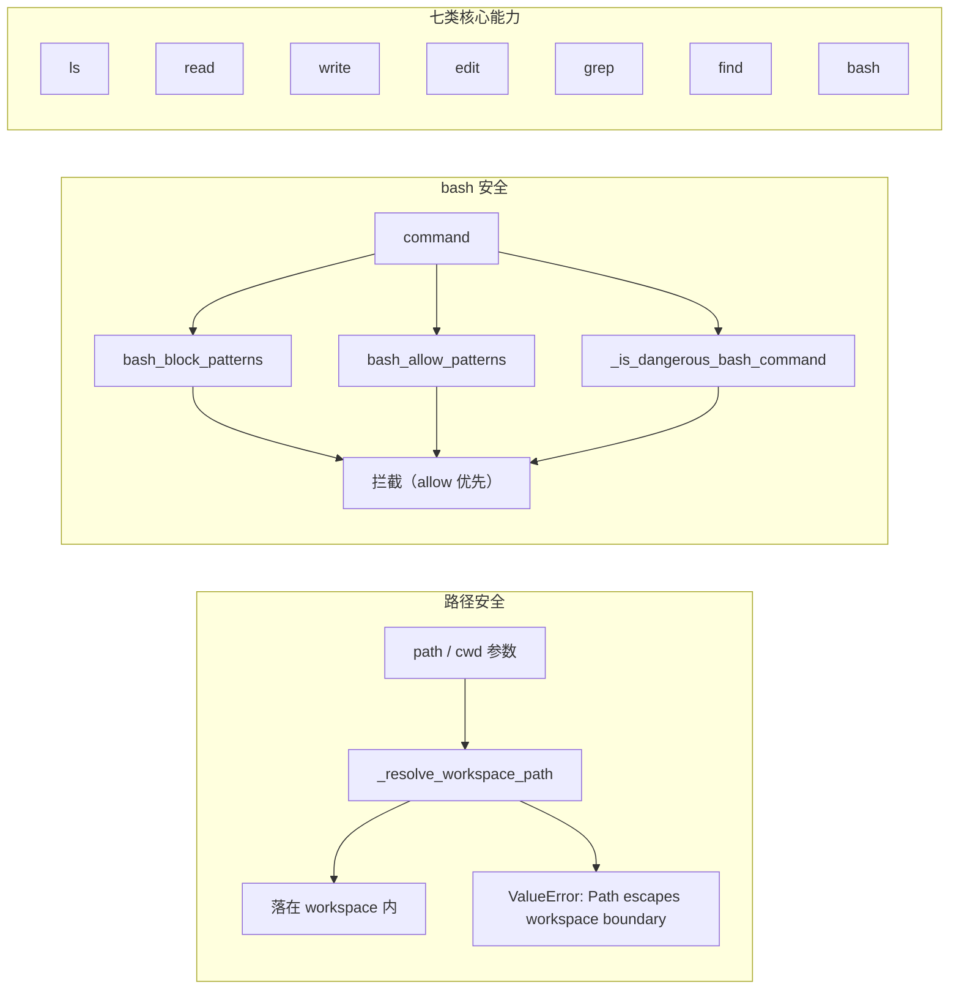

# 内置工具实现：编程场景下的「瑞士军刀」

> 对应源码：`src/coding_agent/builtin_tools.py`

## 先不看代码——用「一把瑞士军刀」来理解

`builtin_tools.py` 提供的是 Agent 在代码仓库里**动手与观察**的最小工具集：有的刀片用来**看**（列目录、读文件、搜内容、找路径），有的用来**改**（写入、按片段替换），还有一把带锁的**多功能刀**（`bash`）能执行系统命令——因此也最需要安全设计。

瑞士军刀的共同特点是：**所有刀刃都从同一个刀柄伸出来**，也就是 `workspace` 根目录。`_resolve_workspace_path` 保证无论用户（或模型）传入的路径字符串怎么写，最终解析结果都必须落在工作区内，防止用 `../` 等方式「伸到别人的抽屉里」。`bash` 则额外配有**危险动作黑名单**与可选的正则允许/拦截列表，像给最锋利的刀片加了保险栓。

实现上，`create_builtin_tools` 根据 `enabled_names` 决定**哪些刀片出厂装配**；若列表为 `None` 则全套可用。只读/改写两类名称集合（`READ_ONLY_TOOL_NAMES` / `MUTATING_TOOL_NAMES`）供上层（例如工厂的只读模式）快速区分**会不会动磁盘或执行进程**。

## 工具与安全策略关系图（Mermaid）



## 源码精读

### 路径解析：防止穿越工作区边界

```python
# builtin_tools.py — 先 resolve 再 relative_to：经典「沙箱路径」写法

def _resolve_workspace_path(workspace_dir: Path, path_text: str) -> Path:
    target = (workspace_dir / path_text).resolve()   # 解析符号链接与 .. 等
    workspace = workspace_dir.resolve()
    try:
        target.relative_to(workspace)   # 不在 workspace 子树下会抛 ValueError
    except ValueError as exc:
        raise ValueError("Path escapes workspace boundary") from exc
    return target
```

### 危险命令粗筛（可与 allow/block 正则组合使用）

```python
# builtin_tools.py — 简单子串匹配，防误删/格式化等常见高危模式

def _is_dangerous_bash_command(command: str) -> bool:
    text = command.lower()
    patterns = [
        "rm -rf", "rm -r ", "rm -fr",
        "del /f", "rmdir /s",
        "format ", "mkfs", "shutdown", "reboot",
        "remove-item -recurse",
    ]
    return any(p in text for p in patterns)
```

### `read_tool`：读文件 + 长度截断

```python
# builtin_tools.py — 相对路径、存在性、必须是文件；超长内容截断并标注

async def read_tool(tool_call_id, params, signal=None, on_update=None) -> AgentToolResult:
    path_text = str(params.get("path", ""))
    max_chars = int(params.get("max_chars", 4000))
    if not path_text:
        return AgentToolResult(content=[TextContent(text="Missing path")], details={})
    target = _resolve_workspace_path(workspace, path_text)
    if not target.exists():
        return AgentToolResult(content=[TextContent(text=f"Path not found: {path_text}")], details={})
    if not target.is_file():
        return AgentToolResult(content=[TextContent(text=f"Not a file: {path_text}")], details={})

    text = target.read_text(encoding="utf-8", errors="replace")
    if len(text) > max_chars:
        text = text[:max_chars] + "\n...<truncated>..."
    return AgentToolResult(content=[TextContent(text=text)], details={})
```

### `edit_tool`：按 old_text 替换，支持唯一匹配约束

```python
# builtin_tools.py — 核心：计数校验、多匹配时要求 replace_all 或 occurrence_index

original = target.read_text(encoding="utf-8", errors="replace")
count = original.count(old_text)
if expected_occurrences is not None and count != expected_occurrences:
    return AgentToolResult(
        content=[TextContent(text=f"Expected {expected_occurrences} matches, but found {count}")],
        details={"matches": count, "expected_occurrences": expected_occurrences},
    )
# 多匹配且未指定 replace_all / occurrence_index 时，可拒绝（edit_require_unique_match）
if not replace_all and count > 1 and occurrence_index is None and edit_require_unique_match:
    return AgentToolResult(
        content=[TextContent(text="Multiple matches found; set replace_all=true or ...")],
        details={"matches": count},
    )
# replace_all → 全部替换；否则按第 n 次或仅替换第一次
```

### `bash_tool`：子进程 + 超时

```python
# builtin_tools.py — asyncio 子进程；wait_for 控制超时；stdout/stderr 合并展示

proc = await asyncio.create_subprocess_shell(
    command,
    cwd=str(cwd),
    stdout=asyncio.subprocess.PIPE,
    stderr=asyncio.subprocess.PIPE,
)
stdout, stderr = await asyncio.wait_for(proc.communicate(), timeout=timeout_seconds)
# asyncio.TimeoutError → 返回超时提示（进程未显式 kill，依平台行为为准，调用方需注意）
```

### 只读 vs 改写：名称集合（供上层过滤）

```python
# builtin_tools.py — 注意：兼容别名 list_dir / read_file / write_file 也在集合中

READ_ONLY_TOOL_NAMES = {"read", "read_file", "grep", "find", "ls", "list_dir"}
MUTATING_TOOL_NAMES = {"write", "write_file", "edit", "bash"}
```

## 七类内置工具参数一览表

> 说明：实现中另有 `list_dir`、`read_file`、`write_file` 作为**兼容别名**，与 `ls`/`read`/`write` 共用同一套 `execute`；下列以七类**语义工具**为准。

| 工具 | 作用简述 | 主要参数 |
|------|----------|----------|
| **ls** | 列出目录下条目（名、类型提示、大小） | `path`（默认 `.`）、`max_entries`（默认 100） |
| **read** | 读取文本文件内容 | `path`（必填）、`max_chars`（默认 4000） |
| **write** | 写入文本文件（可建父目录） | `path`、`content`、`overwrite`（默认 true） |
| **edit** | 将文件中 `old_text` 替换为 `new_text` | `path`、`old_text`、`new_text`、`replace_all`、`occurrence_index`、`expected_occurrences` |
| **grep** | 在目录下按正则搜索行 | `pattern`、`path`（默认 `.`）、`glob`（默认 `**/*`）、`max_matches`、`case_sensitive` |
| **find** | 按 glob 枚举路径 | `path`（默认 `.`）、`pattern`（默认 `**/*`）、`max_results` |
| **bash** | 在 shell 中执行命令 | `command`、`cwd`（默认 `.`）、`timeout_seconds`（默认 30）、`allow_dangerous` |

## 小白避坑指南

1. **把 `path` 当成绝对路径随意传**  
   工具约定路径**相对 workspace**。传绝对路径若落在 workspace 外，会在 `_resolve_workspace_path` 处失败。习惯上始终以项目根为「原点」。

2. **grep 的 `pattern` 写错成正则却按字面量理解**  
   内部使用 `re.compile`，特殊字符需转义；非法正则会返回 `Invalid regex` 提示而非静默无结果。

3. **edit 时 `old_text` 多空格/换行与文件不一致**  
   `count` 基于精确子串匹配；复制粘贴时常见的尾随空格或 `\r\n` 与 `\n` 差异会导致「No match found」或匹配数不符。

4. **以为关掉 `block_dangerous_bash` 就万事大吉**  
   子串黑名单只是**粗粒度**防护；`bash_allow_patterns` 命中可放行黑名单命中的命令，配置不当会打开巨大风险面。`allow_dangerous=true` 更应只在完全可控环境短期使用。
