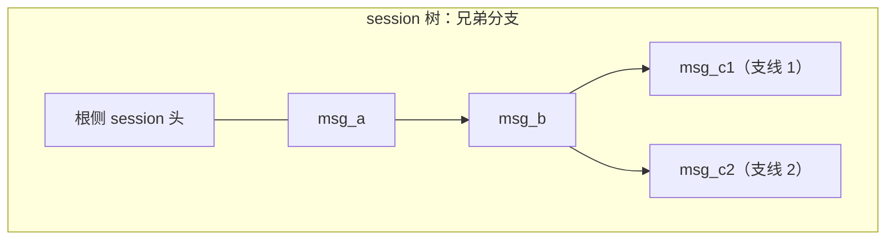
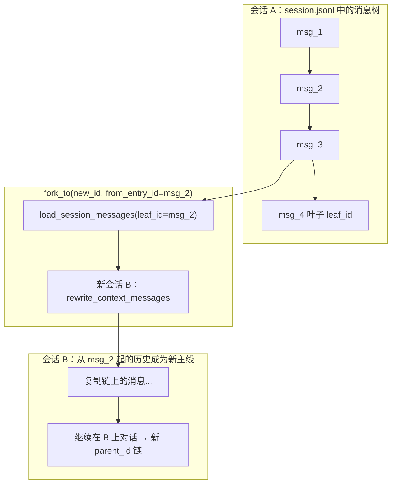

# 会话持久化与分叉：带「分支剧情」的游戏存档

> 对应源码：`src/coding_agent/session_store.py`、`src/coding_agent/serde.py`

## 先不看代码——用「可以回档、可以开平行宇宙的游戏存档」来理解

`SessionStore` 把一次编程对话落盘到 `.liaoclaw/sessions/<session_id>/`，就像 RPG 里每个存档槽位一个文件夹：**meta.json** 记住你是谁、用的哪套模型、当前时间线末端在哪（`leaf_id`）；**context.jsonl** 像「剧情回顾」——按时间顺序一行一条消息，适合快速回放当前上下文；**session.jsonl** 则像「世界状态树」——每条消息节点带着 `parent_id`，从任意节点可以长出**平行分支**，因此同一会话文件里能表达树形历史，而不只是单列时间轴。

**fork**（`fork_to`）就是「从某一帧剧情另存为新档」：从指定 `from_entry_id`（或默认当前叶子）**回溯出一条链上的消息**，写入新会话的 `context.jsonl`，并在新会话的 meta 里记下 `parent_session_id`，同时在旧会话的 `events.jsonl` 记一笔 `session_forked` 事件——像在游戏里明确记下「这条线是从哪一章哪一刻分出来的」。

`serde.py` 不负责目录结构，它是**存档格式翻译器**：把内存里的 `Message`（user / assistant / toolResult）切成可 JSON 化的 dict，读盘时再还原为同类对象，保证工具调用块、思考块、用量字段等不会「读档后变味」。

## 会话树与分叉示意（Mermaid）

**同一父节点下的多条子链（分支）**：`session.jsonl` 里每条 `type=message` 记录都有自己的 `id` 与 `parent_id`。从根到叶是一条「当前选中的时间线」；同一 `parent_id` 指向多个子节点时，磁盘上会形成**兄弟分支**（下文左图）。**fork** 则是把某一节点之前的历史复制到新会话，开启平行存档（右图）。





## 源码精读

### 目录与文件角色

```text
.liaoclaw/sessions/<session_id>/
  meta.json       # session_id、model、provider、system_prompt、leaf_id、parent_session_id、时间戳
  context.jsonl   # 每行：{ ts, message } — 扁平上下文，便于线性加载
  session.jsonl   # 首行可为 session 头；后续 type=message 行带 parent_id，构成树
  events.jsonl    # 如 session_forked 等事件流
```

### JSONL 与 context 写入

```python
# session_store.py — context：一行一个 JSON 对象（JSON Lines）

def append_context_message(self, message: Message) -> None:
    entry = {
        "ts": _utc_now_iso(),
        "message": message_to_dict(message),   # serde：Message → 可持久化 dict
    }
    with self.context_file.open("a", encoding="utf-8") as fp:
        fp.write(json.dumps(entry, ensure_ascii=False) + "\n")
    self.touch_updated_at()
    self.append_session_message(message)   # 同步维护树形 session.jsonl
```

### session 树：`append_session_message` 与 `parent_id` 链

```python
# session_store.py — 新消息的 parent 是当前 meta.leaf_id；写完后更新 leaf_id

lines = self._read_session_lines()
header = lines[0] if lines and lines[0].get("type") == "session" else None
entries = lines[1:] if header else lines
meta = self.read_meta() or {}
parent_id = meta.get("leaf_id")   # 链表头：None 表示第一条用户/助手消息接在「虚拟根」后
entry_id = self._new_entry_id()
entry = {
    "type": "message",
    "id": entry_id,
    "parent_id": parent_id,
    "timestamp": _utc_now_iso(),
    "message": message_to_dict(message),
}
# ... 追加写入 session.jsonl ...
meta["leaf_id"] = entry_id   # 叶子始终指向最后追加的节点（当前时间线末端）
```

### `load_session_messages`：从叶子沿 `parent_id` 回溯再反转

```python
# session_store.py — 从 leaf 往回走链表，reverse 后得到时间正序消息列表

by_id = {str(e.get("id")): e for e in entries if isinstance(e.get("id"), str)}
current = leaf_id or meta.get("leaf_id")
chain = []
seen = set()
while isinstance(current, str) and current in by_id and current not in seen:
    seen.add(current)
    entry = by_id[current]
    chain.append(entry)
    parent_id = entry.get("parent_id")
    current = parent_id if isinstance(parent_id, str) else None

chain.reverse()
messages = [message_from_dict(entry["message"]) for entry in chain if isinstance(entry.get("message"), dict)]
```

### `fork_to`：新会话 + 复制截断历史

```python
# session_store.py — 基于源会话 meta 初始化目标会话，再写入 fork 点之前的消息链

target = SessionStore(self.workspace_dir, new_session_id)
target.ensure_initialized(
    model_id=str(meta.get("model_id", "")),
    provider=str(meta.get("provider", "")),
    system_prompt=str(meta.get("system_prompt", "")),
)
messages = self.load_session_messages(leaf_id=from_entry_id)
target.rewrite_context_messages(messages)   # 会同时重写 target 的 context 与 session 树

tmeta = target.read_meta() or {}
tmeta["parent_session_id"] = self.session_id
target.meta_file.write_text(json.dumps(tmeta, ensure_ascii=False, indent=2), encoding="utf-8")
```

### `serde.py`：消息与字典互转（节选）

```python
# serde.py — Assistant 消息包含 content 块列表、usage、stop_reason 等，需完整往返

def message_to_dict(message: Message) -> dict[str, Any]:
    if isinstance(message, AssistantMessage):
        return {
            "role": "assistant",
            "content": [_assistant_block_to_dict(b) for b in message.content],
            "api": message.api,
            "provider": message.provider,
            "model": message.model,
            "usage": { /* input/output/cache/cost ... */ },
            "stop_reason": message.stop_reason,
            # ...
        }
    # UserMessage / ToolResultMessage 分支同理
    raise TypeError(f"Unsupported message type: {type(message)!r}")

def message_from_dict(data: dict[str, Any]) -> Message:
    role = data.get("role")
    if role == "assistant":
        return AssistantMessage(
            content=[_assistant_block_from_dict(i) for i in data.get("content", []) if isinstance(i, dict)],
            # ...
        )
    # ...
```

## `context.jsonl` 与 `session.jsonl` 有何不同？

| 维度 | context.jsonl | session.jsonl |
|------|----------------|----------------|
| **结构** | 扁平：每行一条带时间戳的消息记录 | 首行可为 session 头；消息行含 `id` / `parent_id`，可表达**树** |
| **典型用途** | 线性恢复「当前上下文窗口」、简单导出 | fork、切换叶子 `set_leaf`、构建 `get_session_tree` |
| **关系** | `append_context_message` 会**同时**追加 session 树节点 | 树可存在多条「从根到不同叶子」的路径；context 通常只保留一条主线叙事 |

二者配合：前者像**自动播放的剧情字幕**，后者像**可选支线的关卡图**。

## 小白避坑指南

1. **手动改 JSONL 时弄坏一行 JSON**  
   `load_context_messages` / `_read_session_lines` 按行 `json.loads`；一行损坏会导致整次读取失败或丢行。应用级应用应优先通过 API 追加，不要手搓半行。

2. **以为删掉 `meta.json` 只影响元数据**  
   `leaf_id` 在 meta 里；若 meta 与 `session.jsonl` 不同步，加载逻辑会尝试回退到最后一条 message，行为可能与预期不符。备份与迁移时**整目录**拷贝更安全。

3. **混淆「扁平 context」与「树 session」导致 fork 后迷惑**  
   `fork_to` 用 `load_session_messages` 从某节点截断链写入新会话；**context.jsonl 在新会话里是重写后的线性历史**，而旧会话里被「放弃」的兄弟分支仍可能留在旧 `session.jsonl` 中，除非你有额外清理策略。

4. **忽略 `serde` 与 `ai.types` 的对应关系**  
   持久化 dict 的 `role`、`content` 块 `type` 必须与 `message_from_dict` 分支一致；自行注入未知 `role` 会触发 `Unknown role`。扩展消息类型前需同时扩展 serde。
