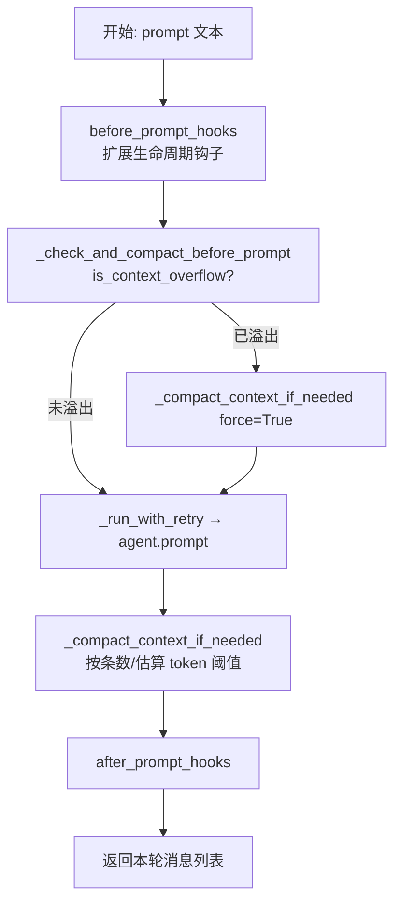

# 上下文压缩与自动重试：像收拾行李箱一样管理对话

> 对应源码：`src/coding_agent/agent_session.py`

## 先不看代码——用「收拾行李：旧衣服装进压缩袋」来理解

想象你要出门旅行，行李箱（**上下文窗口**）容量有限。一开始每件衣服都叠得整整齐齐放进去；聊得越久，「衣服」越多——用户话、助手回复、工具结果全堆在一起，最后箱子盖不上了。

这时你不会把刚要穿的外套扔掉，而是把**很久以前穿过、但可能还有用**的旧衣物抽真空：**用一段话概括它们**，腾出空间，再把**最近几天要穿的**原样保留。`AgentSession` 里的**上下文压缩（compaction）**干的就是这件事：把「老消息」交给 LLM（或兜底逻辑）收成一条摘要用户消息，消息列表变成 `[摘要, …最近 N 条]`，既省 token，又尽量留住关键事实。

另一条线是**自动重试**：调用模型像过收费站，偶尔网络抖一下、服务忙一下就会失败。代码用**指数退避**（等一会儿再试，每次等待翻倍）给系统「喘口气」的机会；但若是**钥匙不对**（鉴权失败），再怎么排队也没用，所以这类错误**直接不重试**。

## 图示（Mermaid）

### 一次 `prompt()` 的生命周期（含压缩与钩子）



### 压缩决策与数据流

```mermaid
flowchart LR
    subgraph 触发条件
        M[消息数 > max_context_messages]
        T[估算 token > max_context_tokens]
        F[force: 调用前检测到溢出]
    end
    M --> X{需要压缩?}
    T --> X
    F --> X
    X -->|否| Z[保持原消息]
    X -->|是| S[older | recent 切分]
    S --> L{summary_builder?}
    L -->|有| SB[自定义摘要]
    L -->|无| LLM[_llm_summary<br/>complete_simple 中文提示]
    LLM -->|失败或空| FB[_fallback_summary 截断拼接]
    SB --> UM[UserMessage 摘要]
    FB --> UM
    UM --> NEW["新列表 = [summary, ...recent]"]
    NEW --> SET[agent.set_messages + 持久化 rewrite]
```

## 源码精读

### 1. 调用 LLM 前先「摸一摸箱子满没满」

`is_context_overflow` 来自 `ai.overflow`：根据当前模型与完整 `Context`（消息、system、工具）判断是否已逼近/超过模型能力。若已满，**在发用户这条 prompt 之前**就先强制压缩一轮，避免请求直接炸掉。

```python
async def _check_and_compact_before_prompt(self) -> None:
    """调用 LLM 前检查上下文是否溢出，如溢出则先压缩。"""
    model = self.agent.state.model
    ctx = Context(
        messages=self.agent.state.messages,
        system_prompt=self.agent.state.system_prompt,
        tools=self.agent.state.tools,
    )
    if is_context_overflow(model, ctx):
        logger.warning(
            "context overflow detected before prompt, triggering compaction session_id=%s",
            self.session_id,
        )
        await self._compact_context_if_needed(force=True)
```

### 2. `_compact_context_if_needed`：切分、摘要、替换（核心流程）

逻辑要点（与源码一致）：

1. **阈值**：配置了 `max_context_messages` / `max_context_tokens` 且超出，或 `force=True`（溢出预警）。
2. **保留最近**：`retain = max(2, min(retain_recent_messages, len(messages)-1))`，老的在 `older`，新的在 `recent`。
3. **摘要**：优先 `summary_builder(older)`；否则 `await _llm_summary(older)`；仍空则 `_fallback_summary(older)`。
4. **写回**：`UserMessage` 带 `[Context Summary]\n...`，再 `set_messages` + `rewrite_context_messages`，并记一条 `context_compacted` 事件。

```python
async def _compact_context_if_needed(self, *, force: bool = False) -> None:
    max_messages = self.max_context_messages
    max_tokens = self.max_context_tokens
    # 条数是否超限
    over_message_limit = bool(max_messages and max_messages > 0 and len(self.agent.state.messages) > max_messages)
    estimated_tokens = estimate_context_tokens(self.agent.state.messages, self.agent.state.system_prompt)
    # token 估算是否超限
    over_token_limit = bool(max_tokens and max_tokens > 0 and estimated_tokens > max_tokens)

    # 非强制且两条都不超 → 直接返回
    if not force and not over_message_limit and not over_token_limit:
        return

    messages = list(self.agent.state.messages)
    # 至少留 2 条、且不超过 retain_recent_messages，并给「最近」留出空间
    retain = max(2, min(self.retain_recent_messages, len(messages) - 1))
    if len(messages) <= retain:
        return

    older = messages[:-retain]   # 要被「抽真空」的部分
    recent = messages[-retain:]   # 原样保留的「最近衣物」

    if self.summary_builder:
        summary_text = self.summary_builder(older).strip()
    else:
        summary_text = await self._llm_summary(older)

    if not summary_text:
        summary_text = self._fallback_summary(older)

    summary_message = UserMessage(
        content=[TextContent(text=f"[Context Summary]\n{summary_text}")],
    )
    compacted = [summary_message, *recent]

    self.agent.set_messages(compacted)
    self.store.rewrite_context_messages(compacted)
    # ... append_event context_compacted ...
```

### 3. `_llm_summary` 与 `_fallback_summary`

- **`_llm_summary`**：把 `older` 格式化成文本，塞进一条用户消息，system 用模块常量 `_COMPACTION_SYSTEM_PROMPT`（中文要点摘要要求），调用 `complete_simple`，最多 `max_tokens=2000`。异常或空字符串则返回 `""`，交给 fallback。
- **`_fallback_summary`**：从最近 20 条消息里抽文本行拼接；总长超过 3000 字符则截断并加 `...<summary truncated>...`。

```python
async def _llm_summary(self, messages: list[Message]) -> str:
    formatted = self._format_messages_for_summary(messages)
    if not formatted.strip():
        return ""
    try:
        summary_context = Context(
            messages=[UserMessage(content=f"请压缩以下对话历史为简明摘要：\n\n{formatted}")],
            system_prompt=_COMPACTION_SYSTEM_PROMPT,
        )
        model = self.agent.state.model
        result = await complete_simple(
            model,
            summary_context,
            SimpleStreamOptions(max_tokens=2000),
        )
        text_parts = [b.text for b in result.content if isinstance(b, TextContent)]
        summary = "\n".join(text_parts).strip()
        if summary:
            return summary
    except Exception as exc:
        logger.warning("LLM compaction failed, using fallback: %s", exc)
    return ""
```

### 4. `_run_with_retry`：指数退避 + `_should_retry` 过滤

- 重试次数：`attempts = max_retries + 1`（若 `retry_enabled`），否则只跑 1 次。
- 每次执行 `op()`（例如 `agent.prompt`），看**最后一条 `AssistantMessage`** 的 `stop_reason` 是否为 `"error"` 或 `"aborted"`，且错误信息里**不像鉴权问题**，才继续下一轮。
- 等待：`delay_ms = retry_base_delay_ms * (2 ** attempt)`，再 `asyncio.sleep(delay_ms/1000)`。

```python
async def _run_with_retry(self, op: Callable[[], Awaitable[list[AgentMessage]]]) -> list[AgentMessage]:
    attempts = self.max_retries + 1 if self.retry_enabled else 1
    last: list[AgentMessage] | None = None

    for attempt in range(attempts):
        messages = await op()
        last = messages

        final_assistant = next(
            (m for m in reversed(self.agent.state.messages) if isinstance(m, AssistantMessage)),
            None,
        )
        should_retry = self._should_retry(final_assistant)
        if not should_retry or attempt >= attempts - 1:
            return messages

        delay_ms = int(self.retry_base_delay_ms * (2**attempt))
        # ... append_event auto_retry_start ...
        await asyncio.sleep(delay_ms / 1000.0)

    return last or []

@staticmethod
def _should_retry(message: AssistantMessage | None) -> bool:
    if message is None:
        return False
    if message.stop_reason not in {"error", "aborted"}:
        return False
    error_text = (message.error_message or "").lower()
    if "invalid_api_key" in error_text or "authentication" in error_text or "unauthorized" in error_text:
        return False
    return True
```

### 5. `prompt` / `continue_run` 里压缩与重试的先后顺序（串联阅读）

```python
async def prompt(self, text: str, *, images: list[str] | None = None) -> list[AgentMessage]:
    await self._run_lifecycle_hooks(text=text, is_continue=False, hooks=self.before_prompt_hooks)
    await self._check_and_compact_before_prompt()
    result = await self._run_with_retry(lambda: self.agent.prompt(text, images=images))
    await self._compact_context_if_needed()
    await self._run_lifecycle_hooks(text=text, is_continue=False, hooks=self.after_prompt_hooks)
    return result
```

## 小白避坑指南

1. **以为只有「超长」才会压缩**  
   除了条数和估算 token，`_check_and_compact_before_prompt` 还会在 `is_context_overflow` 为真时**强制**压缩。即使你没配 `max_context_*`，模型侧判定溢出时仍会触发，避免请求失败。

2. **`prompt_message` 不走完整「前后钩子」链**  
   `prompt()` 会执行 `before_prompt_hooks` / `after_prompt_hooks`，但 `prompt_message` 只做了压缩检查、`prompt` 和事后压缩。若你在扩展里依赖钩子统计或埋点，要确认调用的是哪条 API。

3. **重试看的是「最后一条助手消息」，不是异常**  
   `_run_with_retry` 不会在 `op()` 抛异常时进入退避（那会直接向外抛）。它根据 `AssistantMessage.stop_reason` 与 `error_message` 判断是否再试；鉴权类关键字会**禁止重试**，避免无效等待。

4. **摘要失败不等于会话报废**  
   `_llm_summary` 失败会走 `_fallback_summary`：粗暴拼接+截断。信息会损失，但流程能继续；若对摘要质量有要求，可实现 `summary_builder` 自定义策略，或调大 `retain_recent_messages` 多留原文。
