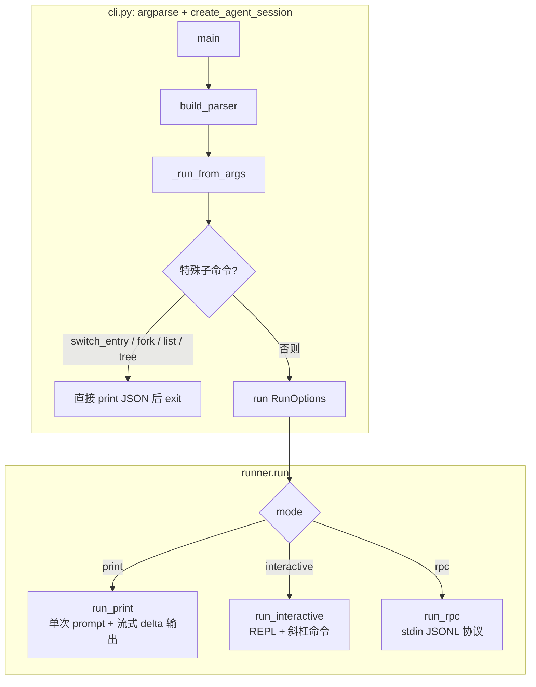
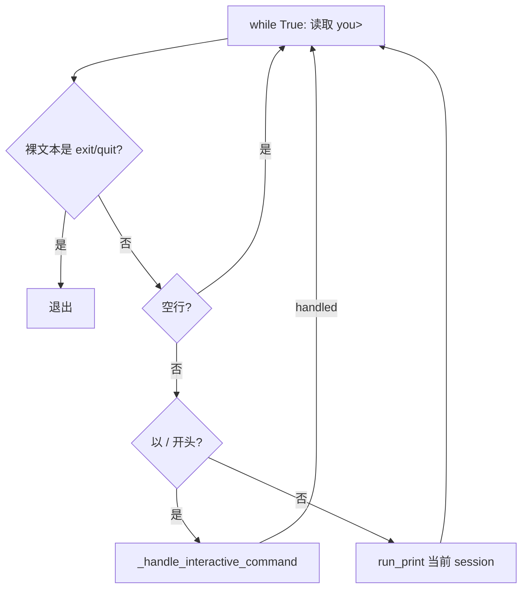

# CLI 与三种运行模式：像点餐一样选「外带、堂食、外卖 API」

> 对应源码：`src/coding_agent/cli.py`、`src/coding_agent/runner.py`

## 先不看代码——用「三种点餐方式」来理解

- **Print 模式（外带）**：你在柜台说一句「要一份套餐」，店员做完递给你，你拿走就结束。对应 **单次 `--prompt`**：进程启动 → 问一句 → 打印结果 → 退出，适合脚本和 CI。
- **Interactive 模式（堂食）**：你坐在店里，可以一轮轮加点菜、问店员菜单，还有「换桌、看分店树、开新单」等**斜杠命令**。对应 **REPL**：`you> ` 循环输入，内置 `/help`、`/session` 等，扩展还能注册自己的命令。
- **RPC 模式（外卖平台 API）**：不写人类终端 UI，而是 **stdin 一行一条 JSON**，像 App 向后厨下单：「来一条 prompt」「查状态」「fork 分支」「关机」。IDE 或插件用管道对接进程，用结构化 **request/response + event** 驱动。

`cli.py` 负责用 **argparse** 把命令行参数收成 `CreateAgentSessionOptions`，建好 `AgentSession`，再交给 `runner.run` 按 `--mode` 分流；`runner.py` 则是三种「就餐方式」的具体实现。

## 图示（Mermaid）

### 三种运行模式总览



### Interactive 循环与斜杠命令



## 源码精读

### 1. `cli.py`：关键 argparse 参数（节选）

`--mode` 三选一：`print` | `interactive` | `rpc`，默认 **interactive**。工作区、会话、模型、工具执行方式等与会话构造相关；另有压缩/重试、只读、bash 策略等开关。

```python
def build_parser() -> argparse.ArgumentParser:
    parser = argparse.ArgumentParser(description="LiaoClaw coding-agent CLI")
    parser.add_argument("--mode", choices=["print", "interactive", "rpc"], default="interactive")
    parser.add_argument("--workspace", default=".", help="Workspace directory")
    parser.add_argument("--session-id", default=None, help="Existing session id to resume")
    parser.add_argument("--provider", default=None, help="Model provider, e.g. anthropic/openai-standard")
    parser.add_argument("--model-id", default=None, help="Model id")
    parser.add_argument("--thinking-level", default="off", help="Thinking level: off/minimal/low/medium/high/xhigh")
    parser.add_argument("--tool-execution", choices=["parallel", "sequential"], default="parallel")
    parser.add_argument("--max-context-messages", type=int, default=None, help="Compaction message threshold")
    parser.add_argument("--max-context-tokens", type=int, default=None, help="Compaction token threshold (approx)")
    parser.add_argument("--prompt", default=None, help="Prompt text (required in print mode)")
    # ... --list-entries, --show-tree, --fork-entry, --switch-entry, --no-retry 等
    return parser
```

`_run_from_args` 里若带 `--switch-entry` / `--fork-entry` / `--list-entries` / `--show-tree`，会**先处理并 `return`**，不会进入 `run()`；否则组装 `RunOptions` 调用 `run(...)`。

```python
await run(
    RunOptions(
        mode=args.mode,
        session=session,
        prompt=args.prompt,
        show_tool_events=not bool(args.no_tool_events),
    )
)
```

### 2. `run()` 分流与 `run_print`

```python
async def run(options: RunOptions) -> AssistantMessage | None:
    if options.mode == "print":
        if not options.prompt:
            raise ValueError("print mode requires prompt")
        return await run_print(
            options.session,
            options.prompt,
            output=options.output,
            show_tool_events=options.show_tool_events,
        )

    if options.mode == "rpc":
        await run_rpc(options.session, output=options.output)
        return None

    await run_interactive(
        options.session,
        input_fn=options.input_fn,
        output=options.output,
        show_tool_events=options.show_tool_events,
        exit_commands=options.exit_commands,
    )
    return None
```

`run_print` 订阅 `AgentEvent`：可选打印 `tool_execution_start/end`，把 `message_update` 里的 `text_delta` 拼起来，最后若没有 delta 则输出最终 assistant 文本，并打印 `stop_reason` / `error_message`。

### 3. Interactive：主循环 + 内置斜杠命令（结构示意）

```python
async def run_interactive(session, *, input_fn=input, output=print, show_tool_events=True, exit_commands=("exit", "quit", ":q")):
    output("Entering interactive mode. Type 'exit' or '/exit' to quit.")
    output(format_commands_for_help(session))
    current_session = session
    while True:
        text = input_fn("you> ").strip()
        bare = text.lstrip("/")
        if bare in exit_commands:
            output("Bye.")
            return
        if not text:
            continue
        if text.startswith("/"):
            handled, switched = await _handle_interactive_command(current_session, text, output=output)
            if switched is not None:
                current_session.close()
                current_session = switched
            if handled:
                continue
        await run_print(current_session, text, output=output, show_tool_events=show_tool_events)
```

`_handle_interactive_command` 内置：`/help`、`/session`、`/tree`、`/clear`（新 session）、`/new` 与 `/fork`（带可选 entry 参数）、`/switch <entry_id>`；未命中时再 `resolve_registered_command` 走**扩展命令**。

### 4. RPC：JSONL 请求类型与响应形状（概念）

进程启动后先打印一行 **`rpc_ready`**（含 `session_id`、`protocol_version`）。随后每行 stdin 为 JSON 对象，字段 **`type`** 表示命令；可选 **`id`** 用于与 `response` 关联。

**常用 `type`（请求）**：

| type | 含义 |
|------|------|
| `prompt` | `text` 字段，调用 `session.prompt` |
| `continue` | `session.continue_run()` |
| `state` | 返回 message_count、entry_ids、leaf_id 等 |
| `list_entries` | 条目列表与 id |
| `show_tree` | 会话树 JSON |
| `fork_entry` | 需要 `entry_id`，fork 后返回 `new_session_id`（fork 的 session 会 close） |
| `switch_entry` | 需要 `entry_id`，切换叶子并返回 path 等 |
| `get_commands` | 运行时命令列表（含扩展） |
| `shutdown` | 正常结束 RPC 循环 |

另：**`entry_path`** 需 `entry_id`，返回从根到该 entry 的路径（源码中有实现，IDE 常用）。

订阅 `session` 的事件会通过 **`{"type": "event", "event": ...}`** 实时写出（与单次请求的 `response` 不同）。

**成功响应**（示意）：

```json
{"type": "response", "id": "<可选>", "command": "prompt", "status": "ok", "data": { ... }}
```

**错误响应**（示意）：

```json
{"type": "response", "id": null, "command": null, "status": "error", "error": {"code": "invalid_json", "message": "..."}}
```

## 小白避坑指南

1. **Print 模式忘了带 `--prompt`**  
   `run()` 里会 `raise ValueError("print mode requires prompt")`，`main` 里转成 `parser.error`。脚本里务必同时指定 `--mode print` 与 `--prompt "..."`。

2. **以为 `/exit` 和 `exit` 完全等价**  
   退出判断用的是 `bare = text.lstrip("/")` 再与 `exit_commands` 比，因此 **`exit` 与 `/exit` 都能退出**；但其它斜杠命令必须以 **`/`** 开头才会进命令分发，普通文本会当作用户问题交给 `run_print`。

3. **`/clear` 与 `/fork` 会切换 `current_session` 并 close 旧的**  
   `/clear` 新建空白会话（新 `session_id`），`/new`、`/fork` 会 `fork_from_entry`。若你在外部还握着旧 session 引用，不要再往旧对象上发请求。

4. **RPC 一行必须是一个完整 JSON**  
   解析失败会回 `invalid_json`；**空行会被跳过**。与 IDE 对接时要约定好编码、`flush`、以及先读 `rpc_ready` 再发命令；`shutdown` 后服务端 `return`，别忘了处理进程退出与 stdin 关闭。
