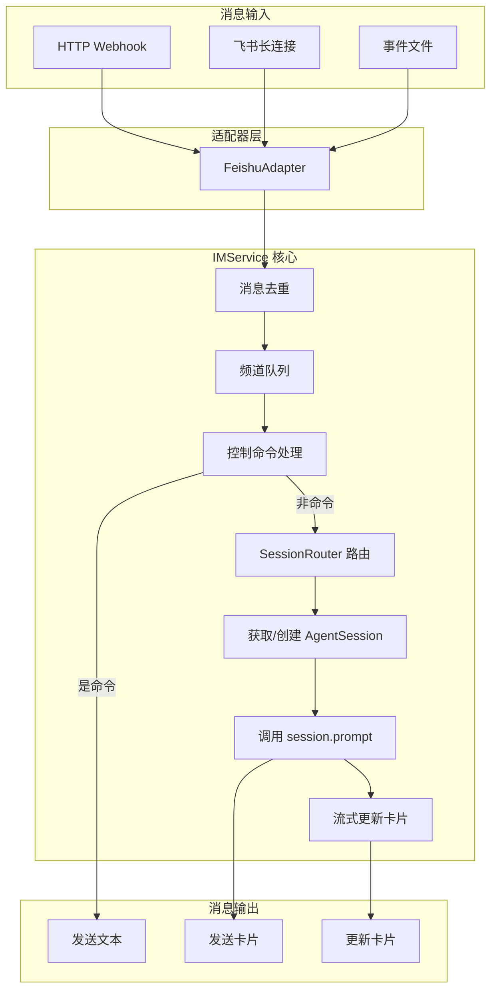

# 01 IM 服务核心架构

> 对应源码：`src/im/service.py`、`src/im/types.py`

## 先不看代码——用"客服中心"来理解

想象你打 10086 客服电话。客服中心的运作模式是这样的：

1. **接线员**（IM 适配器）接到你的电话，把你说的话记录下来
2. **工单系统**（IMService）查一下"这个客户之前有没有在线对话"——如果有，就把之前的对话记录调出来，接着聊；如果没有，就新开一个工单
3. **客服专员**（AgentSession）拿到工单后，开始帮你处理问题
4. 处理过程中，客服会**实时告诉你进展**（流式更新飞书卡片）
5. 如果你在多个窗口同时咨询，每个窗口都有**独立的对话上下文**（频道级会话）

`IMService` 就是这个"客服中心调度系统"——它不关心你用的是飞书还是 Slack（平台无关），只关心消息怎么路由、怎么分发、怎么回复。

## 整体架构图



## 源码精读

### 1. 平台无关的消息类型（`types.py`）

```python
@dataclass
class IMIncomingMessage:
    """统一后的 IM 入站消息——不管来自飞书还是 Slack，格式都一样。"""
    platform: str          # "feishu"、"slack" 等
    channel_id: str        # 频道/群 ID
    user_id: str           # 发送者 ID
    text: str              # 消息文本
    thread_id: str | None  # 话题/线程 ID（用于区分同一群的不同话题）
    message_id: str | None # 消息唯一 ID（用于去重和回复）
    created_at: float | None  # 创建时间戳（用于判断过期消息）
    raw: dict = ...        # 原始平台数据（保留备查）


class IMAdapter(Protocol):
    """IM 适配器的接口规范——任何平台都要实现这些方法。"""
    def handle_webhook(self, headers, body) -> IMWebhookResult: ...
    def send_text(self, message: IMOutgoingText) -> str | None: ...
    def update_text(self, message_id: str, text: str) -> None: ...
    def send_card(self, message: IMOutgoingCard) -> str | None: ...
    def get_user_info(self, user_id: str) -> IMUserInfo | None: ...
    def get_chat_info(self, chat_id: str) -> IMChannelInfo | None: ...
```

**设计亮点**：`IMAdapter` 用 `Protocol` 定义接口，`IMService` 只依赖这个接口，不依赖具体的飞书实现。这样以后要接入 Slack、钉钉，只需要写一个新的 Adapter，`IMService` 的代码完全不用改。

### 2. IMService 核心——消息处理流水线

```python
class IMService:
    def __init__(self, adapter: IMAdapter, config: IMServiceConfig, router=None):
        self.adapter = adapter
        self.config = config
        self.router = router or SessionRouter(config.workspace_dir)
        
        # 消息去重：记录已处理的 message_id
        self._processed_ids: set[str] = set()
        self._processed_id_order: deque[str] = deque()  # 维护顺序，方便淘汰老记录
        
        # 频道队列：每个频道一个消息队列，防止同一频道的消息并发处理
        self._channel_queues: dict[str, deque[IMIncomingMessage]] = {}
        self._channel_running: set[str] = set()
        
        # 频道状态：缓存每个频道的 AgentSession
        self._channel_states: dict[str, _ChannelState] = {}
```

### 3. 消息去重——防止重复处理

```python
async def handle_incoming_message(self, message: IMIncomingMessage) -> None:
    # 1. 去重检查：飞书有时会重复推送同一条消息
    if self._is_duplicate_message(message.message_id):
        logger.warning("skip duplicate message message_id=%s", message.message_id)
        return
    
    # 2. 过期检查：超过 60 秒的消息不处理（比如服务刚重启，收到积压的旧消息）
    if self._is_stale_event(message):
        self._mark_processed(message.message_id)
        return
    
    # 3. 放入频道队列
    channel_key = self._channel_key(message)  # "feishu:chat_id:thread_id"
    queue = self._channel_queues.setdefault(channel_key, deque())
    
    # 4. 队列满了就丢弃（防止某个频道疯狂刷消息）
    if len(queue) >= self.config.channel_queue_limit:
        self._mark_processed(message.message_id)
        return
    
    queue.append(message)
    
    # 5. 如果这个频道已经在处理中，就排队等
    if channel_key in self._channel_running:
        return
    
    # 6. 开始处理队列
    self._channel_running.add(channel_key)
    try:
        while queue:
            current = queue.popleft()
            await self._handle_single_message(current)
    finally:
        self._channel_running.discard(channel_key)
```

**为什么要用队列？** 因为同一个频道的消息必须按顺序处理。如果用户快速发了 3 条消息，不能 3 条同时处理——否则 AgentSession 会乱套（同一时间只能 prompt 一次）。

### 4. 频道级会话管理

```python
def _get_or_create_channel_session(self, message) -> tuple[AgentSession, str]:
    """获取或创建频道级长期 session——同一频道的消息共享同一个对话上下文。"""
    channel_key = self._channel_key(message)
    state = self._channel_states.get(channel_key)

    # 已有缓存，直接用
    if state is not None:
        state.last_active = time.time()
        return state.session, state.session_id

    # 没有缓存，通过 SessionRouter 获取或创建 session_id
    session_id = self.router.get_or_create_session_id(
        platform=message.platform,
        channel_id=message.channel_id,
        thread_id=message.thread_id,
    )

    # 加载长期记忆
    memory_text = load_merged_memory(self.config.workspace_dir, message.channel_id)

    # 创建 AgentSession
    session = create_agent_session(
        CreateAgentSessionOptions(
            workspace_dir=self.config.workspace_dir,
            provider=self.config.provider,
            model_id=self.config.model_id,
            session_id=session_id,
            append_system_prompt=memory_text if memory_text else None,
        )
    )

    # 缓存起来
    self._channel_states[channel_key] = _ChannelState(
        session=session, session_id=session_id,
        last_active=time.time(), user_cache={},
    )
    self._evict_idle_channels()  # 清理超时的频道
    return session, session_id
```

### 5. 流式更新——"打字机效果"

```python
async def _prompt_with_streaming(self, session, text, message):
    """先发占位消息"思考中..."，然后持续更新内容，最后替换为完整回复。"""
    
    # 1. 先发一个占位卡片
    placeholder_id = self.adapter.send_card(
        IMOutgoingCard(
            channel_id=message.channel_id,
            title="LiaoClaw",
            markdown_content="思考中...",
            reply_to_message_id=message.message_id,
        )
    )

    accumulated_text = ""

    # 2. 订阅 Agent 事件，实时更新卡片
    async def _on_event(event):
        nonlocal accumulated_text
        if event.get("type") != "message_update":
            return
        msg = event.get("message")
        if not isinstance(msg, AssistantMessage):
            return
        
        # 提取当前所有文本
        accumulated_text = "".join(
            b.text for b in msg.content if isinstance(b, TextContent)
        )
        
        # 每 1.5 秒更新一次（太频繁会被飞书限流）
        now = time.time()
        if now - last_update_time < 1.5:
            return
        
        # PATCH 更新飞书卡片内容
        self.adapter.update_text(placeholder_id, accumulated_text)

    unsub = session.subscribe(_on_event)
    try:
        await session.prompt(text)
        final_text = self._extract_last_assistant_text(session)
    finally:
        unsub()  # 别忘了取消订阅！

    # 3. 最后一次更新，确保显示完整内容 + 成本统计
    self.adapter.update_text(placeholder_id, final_text + cost_line)
    return final_text
```

### 6. 控制命令

```python
async def _handle_control_command(self, message):
    text = message.text.strip()
    if not text.startswith("/"):
        return False  # 不是命令

    if text in {"/clear", "/new"}:
        # 清除当前频道的会话，新建一个
        self._invalidate_channel_session(message)
        new_id = self.router.rotate_session_id(...)
        self.adapter.send_text(IMOutgoingText(
            text=f"已新建会话：`{new_id}`。后续对话将使用新上下文。",
            ...
        ))
        return True

    if text == "/session":
        # 查看当前会话 ID 和累积 token 使用
        ...
        return True

    if text == "/help":
        # 显示可用命令列表
        ...
        return True
```

## 小白避坑指南

### 坑 1：为什么消息处理要用"频道队列"而不是直接处理？

如果用户在飞书群里快速发了 3 条消息，每条消息都会触发 `handle_incoming_message`。如果不排队：

- 第一条消息触发 `session.prompt("你好")`
- 第二条消息也触发 `session.prompt("帮我看代码")`
- 但 AgentSession 同一时间只能 prompt 一次！→ 第二条会报错 "Agent is already running"

用队列就能保证：第一条处理完了，再处理第二条。

### 坑 2：`_STREAM_UPDATE_INTERVAL = 1.5` 为什么是 1.5 秒？

飞书 API 有频率限制。如果你每 100 毫秒就 PATCH 一次消息，很快就会被限流。1.5 秒是一个平衡：用户能感受到"实时打字"的效果，又不会触发限流。

### 坑 3：为什么要检查 `_is_stale_event`？

服务重启后，飞书可能会重新推送之前没确认的消息（最多 60 秒内的）。如果不过滤，用户会看到 Agent 重复回复之前的问题。`_STALE_EVENT_SECONDS = 60` 就是这个过滤阈值。

### 坑 4：`_evict_idle_channels` 是干什么的？

防止内存泄漏。每个频道的 `AgentSession` 都缓存在内存里。如果一个频道超过 1 小时没有消息，就把它的 session 释放掉。下次来消息时会重新创建（但磁盘上的会话记录还在）。
