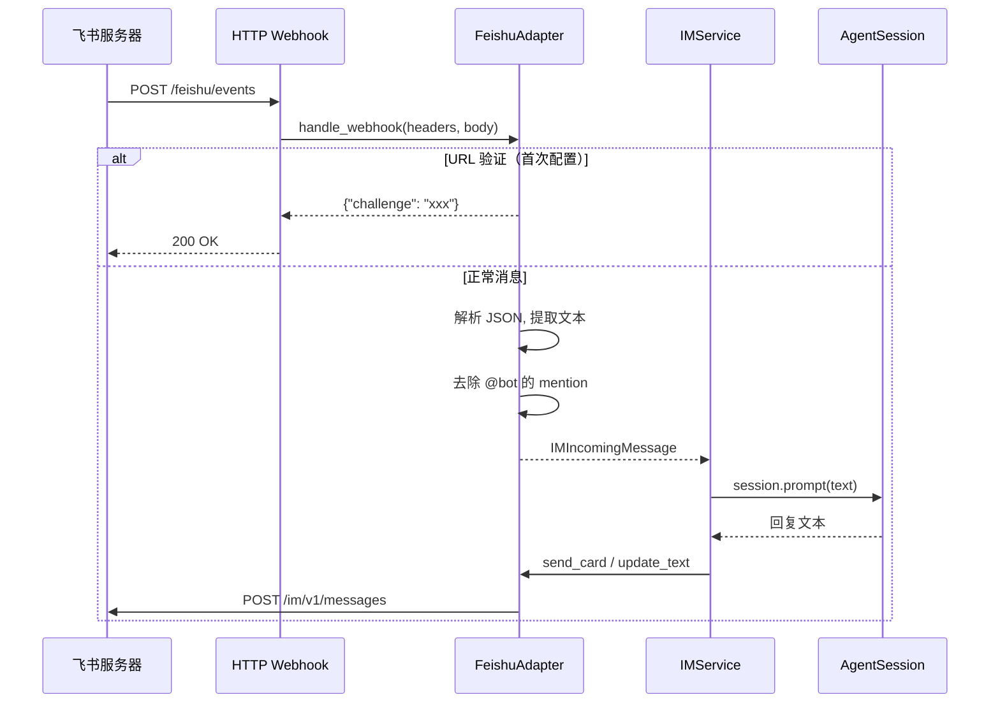

# 02 飞书适配器实现

> 对应源码：`src/im/feishu.py`、`src/im/feishu_longconn.py`、`src/im/server.py`

## 先不看代码——用"翻译官"来理解

想象你在一个国际会议上。你说中文，对方说飞书 API 的"外语"。你需要一个翻译官：

- **听**：把飞书发来的 JSON 数据翻译成 LiaoClaw 能理解的 `IMIncomingMessage`
- **说**：把 LiaoClaw 要回复的文本翻译成飞书能接受的 API 格式
- **记**：记住用户信息和群信息（缓存），不用每次都去查

`FeishuAdapter` 就是这个"飞书翻译官"。它实现了 `IMAdapter` 接口，让 `IMService` 不需要知道飞书 API 的任何细节。

## 消息收发流程



## 源码精读

### 1. Webhook 解析——把飞书 JSON 翻译成统一消息

```python
def handle_webhook(self, headers, body) -> IMWebhookResult:
    payload = self._parse_json(body)

    # 场景1：URL 验证（飞书要求你先证明"这个地址是你的"）
    if payload.get("type") == "url_verification":
        challenge = str(payload.get("challenge", ""))
        return IMWebhookResult(ack={"challenge": challenge}, messages=[])

    # 场景2：验证 token（确保请求真的来自飞书）
    if self.config.verify_token:
        if payload.get("token") != self.config.verify_token:
            return IMWebhookResult(ack={"code": 19021, "msg": "invalid token"}, messages=[])

    # 场景3：只处理 "im.message.receive_v1" 事件
    header = payload.get("header")
    event_type = header.get("event_type") if isinstance(header, dict) else ""
    if event_type != "im.message.receive_v1":
        return IMWebhookResult(ack={"code": 0}, messages=[])

    # 场景4：忽略机器人自己发的消息（防止自我回复死循环）
    sender_type = sender.get("sender_type")
    if sender_type.lower() in {"app", "bot"}:
        return IMWebhookResult(ack={"code": 0}, messages=[])

    # 场景5：只处理文本消息
    if message.get("message_type") != "text":
        return IMWebhookResult(ack={"code": 0}, messages=[])

    # 提取消息文本
    raw_content = message.get("content")  # 飞书的 content 是 JSON 字符串
    content_obj = json.loads(raw_content)  # 解析后：{"text": "@_user_1 你好"}
    content_text = content_obj.get("text", "")

    # 去除 @bot 的 mention 标记（用户 @机器人 时，飞书会插入特殊标记）
    mentions = message.get("mentions") or []
    for m in mentions:
        if m.get("mentioned_type", "").lower() == "bot":
            key = m.get("key", "")
            content_text = content_text.replace(key, "")
    content_text = content_text.strip()

    # 组装统一消息
    return IMWebhookResult(
        ack={"code": 0},
        messages=[IMIncomingMessage(
            platform="feishu",
            channel_id=chat_id,
            user_id=sender_id,
            text=content_text,
            thread_id=thread_id,
            message_id=message_id,
            raw=payload,
        )]
    )
```

### 2. 发送消息——三种方式

```python
# 方式1：发送纯文本
def send_text(self, message: IMOutgoingText) -> str | None:
    token = self._get_tenant_access_token()  # 拿鉴权 token
    content = json.dumps({"text": message.text})
    
    if message.reply_to_message_id:
        # 回复某条消息（会出现引用效果）
        return self._reply_message(httpx, headers, message.reply_to_message_id, "text", content)
    
    # 直接发送新消息
    payload = {
        "receive_id": message.channel_id,
        "msg_type": "text",
        "content": content,
    }
    return self._post_message(httpx, headers, url, payload)


# 方式2：发送 Markdown 卡片（更好看）
def send_card(self, message: IMOutgoingCard) -> str | None:
    content = self._build_card_content(message.title, message.markdown_content)
    # ... 类似 send_text 的逻辑


# 方式3：更新已发送的卡片（流式打字效果的关键）
def update_text(self, message_id: str, text: str) -> None:
    card = self._build_card_content("LiaoClaw", text)
    # 用 PATCH 方法更新消息
    resp = client.patch(url, headers=headers, json={"content": card})
```

**关键理解**：飞书只支持更新**卡片消息**，不支持更新纯文本消息。所以流式打字效果是这样实现的：

1. 先发一个卡片消息，内容是"思考中..."
2. Agent 边想边更新，不断 PATCH 这个卡片的内容
3. 用户看到的效果就是：卡片内容在不断增长

### 3. 鉴权——Tenant Access Token

```python
def _get_tenant_access_token(self) -> str:
    with self._token_lock:  # 线程安全
        now = time.time()
        # 如果 token 还没过期（提前 60 秒刷新），直接用缓存的
        if self._token and now < self._token_expire_at - 60:
            return self._token

        # 否则重新获取
        payload = {
            "app_id": self.config.app_id,
            "app_secret": self.config.app_secret,
        }
        response = client.post(url, json=payload)
        data = response.json()
        
        self._token = data["tenant_access_token"]
        self._token_expire_at = now + data["expire"]  # 通常 2 小时
        return self._token
```

**为什么用 `threading.Lock`？** 因为多个线程可能同时需要 token。如果不加锁，可能会重复请求——浪费且可能被限流。

### 4. 用户信息缓存

```python
def get_user_info(self, user_id: str) -> IMUserInfo | None:
    now = time.time()
    cached = self._user_cache.get(user_id)
    
    # 缓存命中且未过期（默认 1 小时）
    if cached and now - cached[1] < self.config.user_cache_ttl:
        return cached[0]

    # 缓存未命中，调飞书 API 查询
    resp = client.get(f"/contact/v3/users/{user_id}?user_id_type=open_id")
    user = resp.json()["data"]["user"]
    info = IMUserInfo(
        user_id=user_id,
        name=user.get("name", ""),
        avatar_url=user.get("avatar", {}).get("avatar_72", ""),
    )
    
    # 写入缓存
    self._user_cache[user_id] = (info, now)
    return info
```

## 两种接入方式对比

| 特性 | Webhook | 长连接 |
|------|---------|--------|
| 实现文件 | `server.py` | `feishu_longconn.py` |
| 网络需求 | 需要公网 IP 或内网穿透 | 不需要，主动连飞书 |
| 实时性 | 飞书推送，毫秒级 | WebSocket，毫秒级 |
| 部署难度 | 中（需配置回调地址） | 低（运行即可） |
| 适用场景 | 生产环境 | 本地开发/内网环境 |
| 依赖 | `httpx` | `httpx` + `lark-oapi` |

## 小白避坑指南

### 坑 1：飞书的 `content` 字段为什么是 JSON 字符串？

飞书消息的 `content` 不是直接的文本，而是一个 **JSON 字符串**！

```json
// 飞书推送过来的数据
{
  "message": {
    "message_type": "text",
    "content": "{\"text\":\"@_user_1 你好\"}"   // 注意：这是字符串，不是对象！
  }
}
```

所以代码里要 `json.loads(raw_content)` 两次解析。

### 坑 2：为什么要去除 `@bot` 的 mention？

用户在飞书群里 @机器人时，消息文本里会包含一个特殊标记（如 `@_user_1`）。如果不去掉，Agent 会看到一个毫无意义的 `@_user_1` 字符串，影响理解。

### 坑 3：`_import_httpx()` 为什么是延迟导入？

```python
def _import_httpx():
    try:
        import httpx
    except ModuleNotFoundError as exc:
        raise RuntimeError("httpx is required for feishu adapter") from exc
    return httpx
```

因为 `httpx` 是可选依赖。如果用户只是 `import im` 来看看类型定义，不需要真的安装 `httpx`。只有真正发消息时才需要——所以延迟到使用时才导入。

### 坑 4：URL 验证是什么？

飞书在你第一次配置 Webhook 回调地址时，会发一个"验证请求"来确认这个地址是你的。你需要把请求中的 `challenge` 原样返回。这个流程只在配置时发生一次，之后就不会再出现了。
