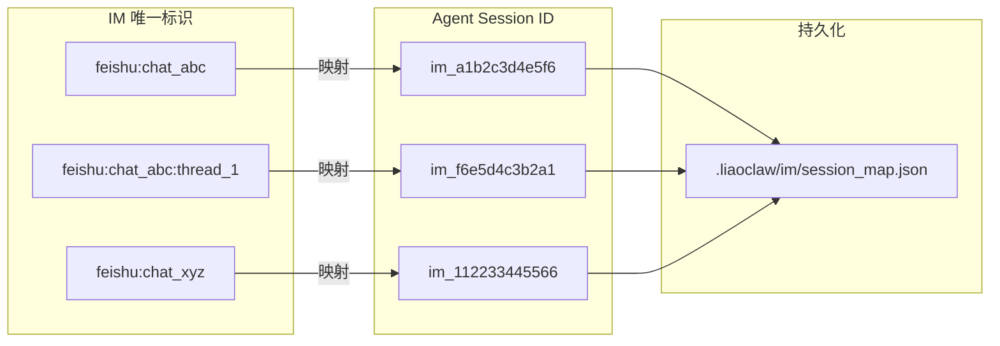
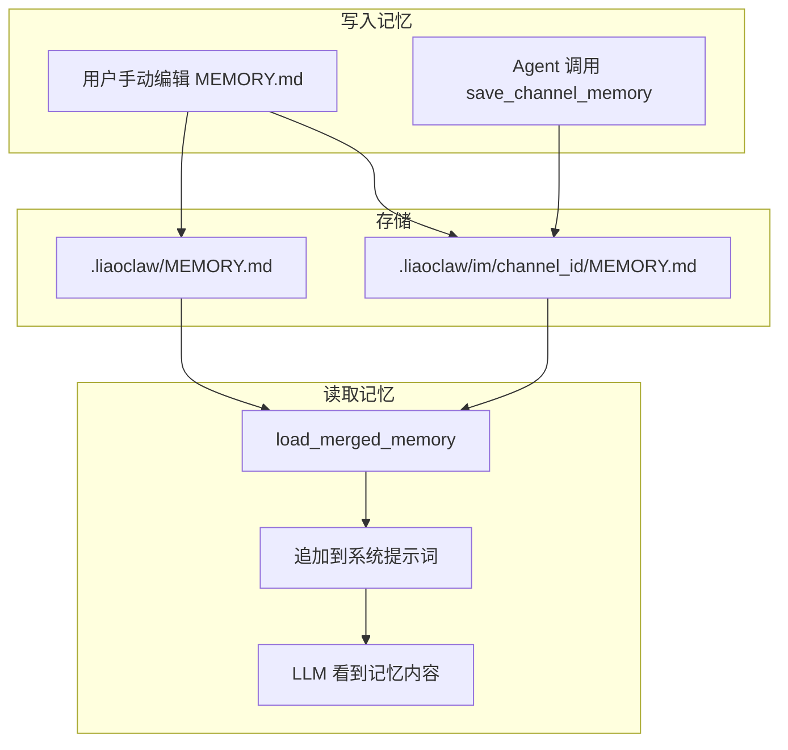

# 03 会话路由与记忆系统

> 对应源码：`src/im/session_router.py`、`src/im/memory.py`

## 先不看代码——用"酒店前台"来理解

想象你去一家连锁酒店住几天：

- **会话路由**（SessionRouter）就像酒店的房卡系统。你第一次来，前台给你分配一个房间号（session_id）；下次再来，刷身份证就能找到你之前的房间，行李还在原地。如果你要换一间全新的房间（`/new` 命令），前台就给你重新分配一个新房号。

- **记忆系统**（MEMORY.md）就像酒店的客户档案。档案分两层：
  - **全局档案**：记录你对整个酒店的偏好（"这位客人喜欢高楼层、不吃辣"）
  - **房间档案**：记录你在某个特定房间的状态（"床头柜上放了笔记本"）

两者配合，让 Agent 具备了"跨对话记忆"的能力——即使中间重启了服务，也能找回之前的对话和偏好。

## 路由映射关系



**关键规则**：
- 同一个飞书群（`chat_abc`）的所有消息共享同一个 session
- 同一个群的不同话题线程（`thread_1`）有独立的 session
- `session_map.json` 文件持久化映射关系，服务重启后还能找到

## 源码精读

### 1. SessionRouter——路由映射

```python
class SessionRouter:
    def __init__(self, workspace_dir):
        self.workspace_dir = Path(workspace_dir)
        # 映射文件：.liaoclaw/im/session_map.json
        self.state_file = self.workspace_dir / ".liaoclaw" / "im" / "session_map.json"
        self.state_file.parent.mkdir(parents=True, exist_ok=True)

    def get_or_create_session_id(self, *, platform, channel_id, thread_id=None) -> str:
        """获取已有的 session_id，没有就新建一个。"""
        key = self._build_key(platform=platform, channel_id=channel_id, thread_id=thread_id)
        state = self._read_state()  # 读取 JSON 文件
        
        existing = state.get(key)
        if isinstance(existing, str) and existing:
            return existing  # 找到了，直接返回
        
        # 没找到，生成新的 session_id
        new_id = f"im_{uuid.uuid4().hex[:12]}"
        state[key] = new_id
        self._write_state(state)  # 写回 JSON 文件
        return new_id

    def rotate_session_id(self, *, platform, channel_id, thread_id=None) -> str:
        """强制轮换 session_id（用于 /clear 和 /new 命令）。"""
        key = self._build_key(platform=platform, channel_id=channel_id, thread_id=thread_id)
        state = self._read_state()
        new_id = f"im_{uuid.uuid4().hex[:12]}"
        state[key] = new_id  # 覆盖旧的
        self._write_state(state)
        return new_id

    @staticmethod
    def _build_key(*, platform, channel_id, thread_id) -> str:
        """构建唯一标识。"""
        if thread_id:
            return f"{platform}:{channel_id}:{thread_id}"
        return f"{platform}:{channel_id}"
```

**`session_map.json` 文件长这样**：

```json
{
  "feishu:oc_abc123": "im_a1b2c3d4e5f6",
  "feishu:oc_abc123:om_thread1": "im_f6e5d4c3b2a1",
  "feishu:oc_xyz789": "im_112233445566"
}
```

### 2. MEMORY.md——两级记忆系统

```python
def load_global_memory(workspace_dir) -> str:
    """加载全局记忆。"""
    path = Path(workspace_dir) / ".liaoclaw" / "MEMORY.md"
    return _read_memory_file(path)


def load_channel_memory(workspace_dir, channel_id) -> str:
    """加载频道级记忆。"""
    path = Path(workspace_dir) / ".liaoclaw" / "im" / channel_id / "MEMORY.md"
    return _read_memory_file(path)


def load_merged_memory(workspace_dir, channel_id=None) -> str:
    """合并全局 + 频道记忆，格式化后注入系统提示词。"""
    sections = []
    
    global_mem = load_global_memory(workspace_dir)
    if global_mem:
        sections.append(f"## Global Memory\n{global_mem}")

    if channel_id:
        channel_mem = load_channel_memory(workspace_dir, channel_id)
        if channel_mem:
            sections.append(f"## Channel Memory ({channel_id})\n{channel_mem}")

    return "\n\n".join(sections)
```

**记忆文件的存放位置**：

```
.liaoclaw/
├── MEMORY.md                          # 全局记忆
└── im/
    ├── session_map.json               # 路由映射
    ├── oc_abc123/
    │   └── MEMORY.md                  # 频道 abc123 的记忆
    └── oc_xyz789/
        └── MEMORY.md                  # 频道 xyz789 的记忆
```

### 3. 记忆是怎么注入到 Agent 的？

在 `service.py` 中创建会话时：

```python
# IMService._get_or_create_channel_session 中：
memory_text = load_merged_memory(self.config.workspace_dir, message.channel_id)
append_prompt = f"\n\n长期记忆（MEMORY）：\n{memory_text}" if memory_text else ""

session = create_agent_session(
    CreateAgentSessionOptions(
        ...
        append_system_prompt=append_prompt,  # 记忆被追加到系统提示词末尾
    )
)
```

在 `factory.py` 中也会加载全局记忆：

```python
from im.memory import load_global_memory
memory_text = load_global_memory(workspace)
# memory_text 被传入 build_system_prompt
```

## 记忆的完整数据流



## MEMORY.md 的使用建议

全局记忆（`.liaoclaw/MEMORY.md`）可以写这些内容：

```markdown
# 全局记忆

## 项目信息
- 项目名称：LiaoClaw
- 技术栈：Python 3.10+, httpx, asyncio
- 代码风格：遵循 PEP 8，使用 dataclass

## 用户偏好
- 回复使用中文
- 代码注释使用中文
- 优先使用 pathlib 而非 os.path
```

频道记忆（`.liaoclaw/im/<channel_id>/MEMORY.md`）可以写：

```markdown
# 频道记忆

## 当前任务
- 正在重构 ai/providers 模块
- 上次讨论到 stream_anthropic 的错误处理

## 注意事项
- 这个频道的成员主要是前端同学，解释时避免太多后端术语
```

## 小白避坑指南

### 坑 1：`session_map.json` 能手动编辑吗？

可以，但要小心。如果你把某个 key 的值改成一个不存在的 session_id，下次收到消息时会创建一个空白的新会话（旧的对话记录还在磁盘上，但不会被自动加载）。

### 坑 2：`rotate_session_id` 后旧 session 去哪了？

旧 session 的文件（`.liaoclaw/sessions/im_xxx/`）还在磁盘上，不会被删除。只是 `session_map.json` 里的指向变了。如果你想恢复旧对话，可以手动把 JSON 里的值改回去。

### 坑 3：MEMORY.md 支持什么格式？

任意 Markdown 格式。它会被原样注入系统提示词——所以你可以用标题、列表、代码块等。但要注意**长度**：太长的记忆会占用大量上下文窗口，留给对话的空间就少了。建议控制在 1000 字以内。

### 坑 4：全局记忆和频道记忆冲突了怎么办？

两者会被合并显示，不会互相覆盖。如果内容有矛盾（比如全局说"用英文回复"，频道说"用中文回复"），LLM 通常会优先采用**后出现的**（即频道级记忆），因为它离当前上下文更近。但这不是硬性保证，取决于 LLM 的理解。
